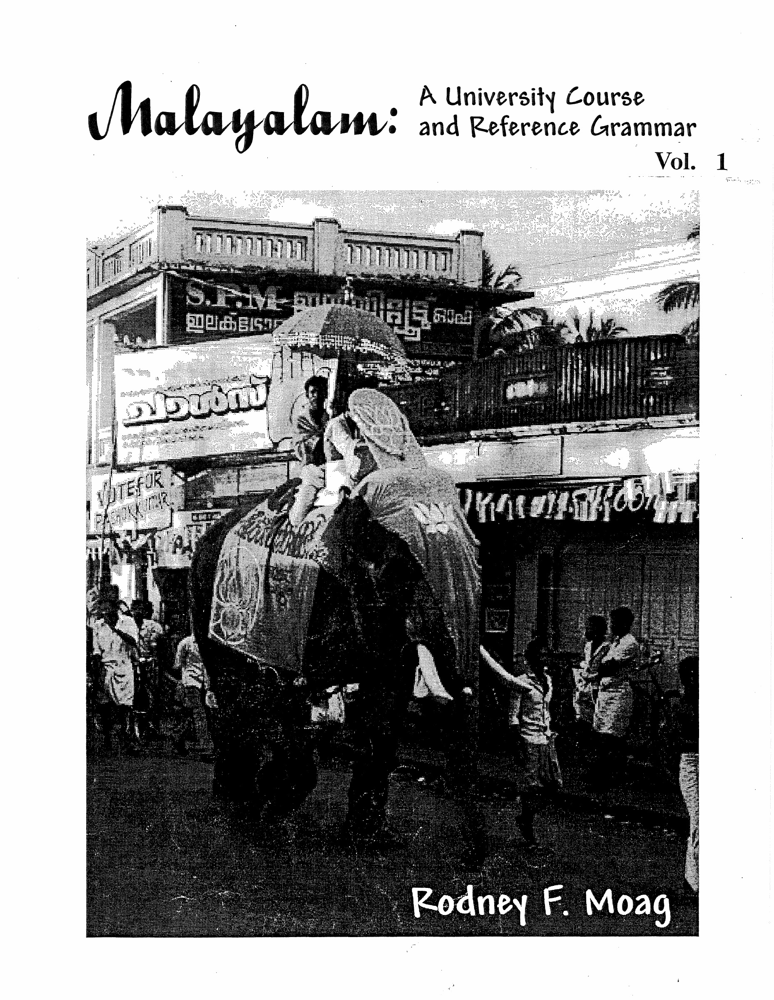

# Front Matter

<!-- Source: PDF page 1; printed page unnumbered. -->

The University of Texas at Austin  
South Asia Institute

## Open Educational Resources for South Asian Language Instruction

Language: Malayalam

Malayalam: A University Course and Reference Grammar by Rodney F. Moag is licensed under a [Creative Commons Attribution-NonCommercial-ShareAlike 4.0 International License](https://creativecommons.org/licenses/by-nc-sa/4.0/).

This work is normally printed in two volumes (the second volume beginning with Lesson 17), but it is presented here in a single document.

Created in cooperation with the Center for Open Educational Resources and Language Learning.

Last updated: April 2018  
Rodney F. Moag  
Professor Emeritus  
University of Texas at Austin

<!-- Source: PDF page 2; printed page unnumbered. -->

## Malayalam: A University Course and Reference Grammar

Vol. 1

Rodney F. Moag

<!-- Source: PDF page 3; printed page unnumbered. -->

## Malayalam: A University Course and Reference Grammar

Fourth Edition

Rodney F. Moag

Published by The Center for Asian Studies  
The University of Texas at Austin  
Spring, 2002

<!-- Source: PDF page 4; printed page unnumbered. -->

<!-- Blank source page. -->

<!-- Source: PDF page 5; printed page unnumbered. -->

## Table of Contents

| Contents | Page |
|---|---|
| Acknowledgments | i |
| Preface | iii |
| The Book and How to Use It | vii |
| Malayalam Script | xv |
| LESSON ONE | 1 |
| LESSON ONE CONVERSATION: What is Your Name? | 3 |
| LESSON ONE GRAMMAR NOTES | 6 |
| 1.1. How to Use Grammatical Explanations | 6 |
| 1.2. The Order of Elements Within the Sentence | 6 |
| 1.3. Equative Sentences | 6 |
| 1.4. Copula Deletion in Short Sentences Giving Names | 7 |
| 1.5. The Quotative or Citation Particle എന്ന് | 7 |
| 1.6. Social Dimensions of the Personal Pronouns | 8 |
| LESSON TWO | 11 |
| LESSON TWO CONVERSATION: Mr. Thomas' Office | 15 |
| LESSON TWO GRAMMAR NOTES | 19 |
| 2.1. The Locative Case of Nouns | 19 |
| 2.2. Spelling Changes in Adding Vowel-Initial Suffixes | 20 |
| 2.3. -ഓ as a Marker for Yes-No Questions | 21 |
| 2.4. Verbal Cues for the Near-Far Distinction | 22 |
| 2.5 Changing the Order of Sentence Elements for Emphasis | 23 |
| 2.6 Spelling and Pronunciation Changes when Joining -ഉം | 25 |
| LESSON THREE | 26 |
| LESSON THREE CONVERSATION: Is James Here? (Lending and Borrowing) | 28 |
| LESSON THREE GRAMMAR NOTES | 35 |
| 3.1 Existive/Locative Sentences with ഉണ്ട് | 35 |
| 3.2 "One of Your" Possessive Phrases | 37 |
| 3.3 Possessive Sentences: Alienable versus Inalienable Possession | 37 |
| 3.4 The Polite Command and Citation Forms of Verbs | 39 |
| 3.5 Impersonal Expressions for Health and Welfare | 39 |
| 3.6 Coordinate Conjunctions “... and... and” | 40 |
| LESSON FOUR | 39 |
| LESSON FOUR CONVERSATION: Going to the Teashop | 41 |
| LESSON FOUR GRAMMAR NOTES | 47 |
| 4.1 Wishes and Desires the Indirect Form വേണം | 47 |
| 4.2. Likes and Desires Indirect Sentences with ഇഷ്ടമാണ് | 48 |
| 4.3 Differing Responses to Yes-No Questions According to the Verb | 49 |
| 4.4 The Dative For Indirect Objects | 50 |
| 4.5 Differences in the Dative Ending | 50 |
| 4.6 Two Kinds of "Giving" | 52 |
| LESSON FIVE | 53 |
| LESSON FIVE CONVERSATION: Will Krishnan Go to the Movies? | 55 |
| LESSON FIVE GRAMMAR NOTES | 59 |
| 5.1 The Simple Present Tense | 59 |
| 5.2 The Gerund and the Infinitive of Purpose | 60 |
| 5.3 More Possessive with ഉണ്ട് | 61 |
| 5.4 Changing the Order of Elements in the Sentence for Emphasis | 61 |

<!-- Source: PDF page 6; printed page unnumbered. -->

| Contents | Page |
|---|---|
| 5.5 The Negative Question Marker -േ- | 62 |
| 5.6 The Plural Marker for Nouns and its Spelling Changes | 63 |
| 5.7 Verbstems and the Hint of [y] യ | 65 |
| LESSON SIX | 67 |
| LESSON SIX CONVERSATION: Do You Know the Brahmin Hotel? (Directions) | 69 |
| LESSON SIX GRAMMAR NOTES | 75 |
| 6.1 The Polite Assertive Marker -അല്ലോ | 75 |
| 6.2 The Negative Question as a Signposting and Rhetorical Device | 76 |
| 6.3 The Intentive or Potential Verb Ending | 77 |
| 6.4 The Indirect Uses of അറിയുക | 78 |
| 6.5 The Postpositions and their Case Requirements | 79 |
| 6.6 The Possessive Form (Case) of the Noun | 80 |
| 6.7 More Uses of the -ാൻ Verbform | 83 |
| LESSON SEVEN | 86 |
| LESSON SEVEN CONVERSATION: Where Will I Catch the Quilon Bus? | 91 |
| LESSON SEVEN GRAMMAR NOTES | 95 |
| 7.1 The General Future and the Habitual Ending -ഉം | 95 |
| 7.2 The Impersonal Verb കിട്ടുക | 98 |
| 7.3 Asking and Telling Time | 98 |
| 7.4 The Locative Requirement with Verbs of Motion | 99 |
| 7.5 The Two Part Qualifier എയുള്ളൂ | 99 |
| 7.6 Spelling Changes When Joining എയുള്ളൂ and എങ്കിൽ | 101 |
| 7.7 The Hortative "Let’s" Verbform | 101 |
| LESSON EIGHT | 103 |
| LESSON EIGHT CONVERSATION: Hey James! (Adjective/Relative Clauses) | 107 |
| LESSON EIGHT GRAMMAR NOTES | 113 |
| 8.1 Uses and Forms of the Accusative Form (Case) of the Noun | 113 |
| 8.2 Adjective or Relative Clauses Made with Present Verbform | 115 |
| 8.3 The Addressive or Associative Form of the Noun | 116 |
| 8.4 The Desiderative Form of the Verb -ണം | 118 |
| 8.5 Reported Commands with the Infinitive | 120 |
| 8.6 Tag Questions | 121 |
| 8.7 Times of the Day | 124 |
| MINILESSON A | 126 |
| LESSON NINE | 127 |
| LESSON NINE CONVERSATION: Sharing Saris | 130 |
| LESSON NINE GRAMMAR NOTES | 135 |
| 9.1 Making Pronouns and Noun Phrases from Adjectives | 135 |
| 9.2 The Complex Verb ആയിരിക്കുക | 137 |
| 9.3 Temporary versus Inherent Good | 137 |
| 9.4 The Special Expression കൊള്ളാം | 138 |
| 9.5 The Generic Meaning of the Particle -ഉം | 138 |
| LESSON TEN | 141 |
| LESSON TEN TEXT: All About the Geography of Kerala | 143 |
| LESSON TEN GRAMMAR NOTES | 147 |
| 10.1 Special Locative Forms for Kerala Placenames | 147 |
| 10.2 Markers of Formal Style | 147 |
| 10.3 The Dative in Expressions of Direction | 148 |
| 10.4 Special Adjective Forms of the Directions | 149 |
| 10.5 The Citation Marker എന്ന് with a Series | 149 |
| 10.6 Expressions of Distance | 149 |

<!-- Source: PDF page 7; printed page unnumbered. -->

| Contents | Page |
|---|---|
| 10.7 The Deletion of Halfmoon in Connected Text | 150 |
| 10.8 Clefting Sentences with Desiderative Verbs | 150 |
| LESSON ELEVEN | 151 |
| LESSON ELEVEN CONVERSATION: Sending Little Brother to the Market | 155 |
| LESSON ELEVEN GRAMMAR NOTES | 161 |
| 11.1 The Simple Past Tense Form of the Verb | 161 |
| 11.2 The Cleft Sentence as a Means of Focus | 162 |
| 11.3 The Compound Verb with the Completive Meaning | 164 |
| 11.4 Irregular Past Forms of ആണ് ഉണ്ട് and നന്നായിരിക്കുക | 165 |
| 11.5 The Past Tense of Desiderative Forms | 168 |
| MINILESSON B | 169 |
| LESSON TWELVE | 171 |
| LESSON TWELVE CONVERSATION: Husband and Wife | 174 |
| LESSON TWELVE GRAMMAR NOTES | 178 |
| 12.1 Consonant Doubling in Caseforms of Words in ം. | 178 |
| 12.2 Indirect Quotes With the Quotative Marker എന്ന് | 179 |
| 12.3 Norms of Address and Reference for Husbands and Wives | 181 |
| 12.4 Verbal Nouns with Postpositions | 181 |
| 12.5 The Permissive Form of the Verb | 182 |
| 12.6 The Verb അറിയുക with Nominative Subjects | 184 |
| LESSON THIRTEEN | 185 |
| LESSON THIRTEEN CONVERSATION: Form-Filling at Mr. Menon's Office | 187 |
| LESSON THIRTEEN GRAMMAR NOTES | 191 |
| 13.1 The Stative Perfect Form of the Verb | 191 |
| 13.2 The Conjunctive Verbform (Participle) | 193 |
| 13.3 The Conjunctive Verbform in Complex Sentences | 193 |
| 13.4 The Intensifying Prefix അതി | 196 |
| 13.5 The Past Verbal Adjective | 196 |
| 13.6 Postpositions Requiring Nominative Case | 197 |
| 13.7 Accusative as Indirect Object | 198 |
| LESSON FOURTEEN | 199 |
| LESSON FOURTEEN GRAMMAR NOTES | 204 |
| 14.1 The Generalizing Particle -ഉം | 204 |
| 14.2 Uses of Present Conditional Sentences | 206 |
| 14.3 The “Either...Or” Construction | 207 |
| 14.4 Relative and Descriptive Clauses Formed with -ഉള്ള | 208 |
| 14.5 Irregular Possessive Forms in -ന്റെ | 209 |
| MINILESSON C | 210 |
| LESSON FIFTEEN | 212 |
| LESSON FIFTEEN GRAMMAR NOTES | 219 |
| 15.1 Cleft Sentences with Non-emphatic Order | 219 |
| 15.2 The Discontinuous -ഉം Required with “Both” | 220 |
| 15.3 The Verbal Adjective in Relative Clauses | 220 |
| 15.4 Indirect Expressions of Pleasure and Desire | 221 |
| 15.5 The Indirect Verb തോന്നുക | 223 |
| 15.6 Inflected Forms of the Verbal Noun | 224 |
| MINILESSON D | 226 |
| LESSON SIXTEEN | 228 |
| LESSON SIXTEEN GRAMMAR NOTES | 235 |
| 16.1 The Special Adjective of -ം Final Nouns | 235 |
| 16.2 The Subjectless Construction | 235 |
| 16.3 The Use of കാണുക as a Subjectless Verb | 236 |

<!-- Source: PDF page 8; printed page unnumbered. -->

| Contents | Page |
|---|---|
| 16.4 The Special Possessive Ending -ലെ | 237 |
| 16.5 Adding എ....യുള്ളൂ to Verbforms | 237 |
| MINILESSON E | 239 |
| LESSON SEVENTEEN | 240 |
| LESSON SEVENTEEN GRAMMAR NOTES | 246 |
| 17.1 Half and Quarter Hours, and Other Precise Times | 246 |
| 17.2 Numbers: Ordinals, Adjectives and Adverbs | 248 |
| 17.3 The Remote Past Verbform | 248 |
| 17.4 Familiar and Formal Commands | 250 |
| 17.5 The Emphatic Present Verbform with -ന്നുണ്ട് | 252 |
| LESSON EIGHTEEN | 253 |
| LESSON EIGHTEEN GRAMMAR NOTES | 259 |
| 18.1 The Colloquial Locative Ending എ | 259 |
| 18.2 How to Tell Your Left Hand from Your Right | 259 |
| 18.3 Using the Name as a Term of Address | 260 |
| 18.4 The Negative Conjunctive Verbform | 261 |
| 18.5 Polite Negative Commands | 264 |
| 18.6 Compound Verbs showing Unintentional Involvement | 264 |
| 18.7 Equational Sentences with ഉള്ളത് | 265 |
| 18.8 Rhetorical Questions as Emphatic Statements | 266 |
| LESSON NINETEEN | 268 |
| LESSON NINETEEN GRAMMAR NOTES | 277 |
| 19.1 Mildness and Deference During Confrontation | 277 |
| 19.2 The Familiar / Forceful Negative Command Form | 278 |
| 19.3 Summing Up the Uses of the Verbal Noun in -അത് | 279 |
| 19.4 The Repetitive Verbform with -ാറുണ്ട് | 280 |
| 19.5 Negative Verbal Adjectives and Nouns | 280 |
| 19.6 Relative Clause with Personal Relative Pronouns | 282 |
| 19.7 The Present Perfect Verbform | 284 |
| 19.8 Statements and Commands Using the Double Negative | 287 |
| LESSON TWENTY | 289 |
| LESSON TWENTY GRAMMAR NOTES | 298 |
| 20.1 Adjectival/Relative Clauses Formed with -ആയ | 298 |
| 20.2 Another Impersonal Expression of Liking | 302 |
| 20.3 Spelling Changes: Miscellaneous Changes with പ Initial Postpositions | 303 |
| 20.4 The Instrumental Form of the Noun, and the Instrumental Case Role in the Sentence | 303 |
| 20.5 The Passive Voice Construction | 305 |
| 20.6 Joining Two Clauses Showing Simultaneous Action Over Time | 306 |
| 20.7 Causative and Double Causative Verbs | 307 |
| LESSON TWENTY ONE | 312 |
| LESSON TWENTY-ONE GRAMMAR NOTES | 321 |
| 21.1 Time Adverbial Clauses with -പ്പോൾ and ഉടൻ | 321 |
| 21.2 Time Adverbial Clauses with "by the time" and "as long as" | 323 |
| 21.3 The Vocative Form of the Noun | 325 |
| 21.4 Degrees of Probability with the Modal Auxiliary | 326 |
| 21.5 Impersonal Expressions for Physical and Emotional Conditions | 328 |
| 21.6 The Progressive Aspect of the Verb | 328 |
| 21.7 A Close Look at Compound Verbs | 329 |
| LESSON TWENTY TWO | 332 |
| LESSON TWENTY-TWO GRAMMAR NOTES | 341 |

<!-- Source: PDF page 9; printed page unnumbered. -->

| Contents | Page |
|---|---|
| 22.1 Indefinite Pronouns With Hypothetical Versus Actual Referents | 341 |
| 22.2 One Member of the Class or the Other | 344 |
| 22.3 The Human Suffix of Association or Agency | 344 |
| 22.4 Verbs and Nouns of Experience formed with പെടുക | 346 |
| 22.5 The Adverb Marker ആയി | 347 |
| 22.6 The "about to" Verbform | 349 |
| LESSON TWENTY THREE | 351 |
| LESSON TWENTY-THREE GRAMMAR NOTES | 360 |
| 23.1 Three Negative Prefixes | 360 |
| 23.2 Summing Up on Conditional Sentences | 362 |
| 23.3 Emphasis Using the Citation form of the Verb | 365 |
| 23.4 Kerala Temple Festivals | 366 |
| 23.5 Compound Verb Signifying Agreement or Probability | 366 |
| 23.6 Deferential Agreement with -എ | 367 |
| MINILESSON F | 368 |
| LESSON TWENTY FOUR | 369 |
| LESSON TWENTY-FOUR GRAMMAR NOTES | 378 |
| 24.1 Nouns Derived from Verbs | 378 |
| 24.2 How to form Comparatives and Superlatives | 381 |
| 24.3 The Compound Verb showing Self Benefit | 385 |
| 24.4 Placement of Articles and other Elements in the Noun Phrase | 386 |
| 24.5 Alternative Ways to Make Relative Clauses from Postpositions | 389 |
| 24.6 Several More Ways to Say Can | 389 |
| 24.7 A Fuller Look at the Associative Case | 393 |
| MINILESSON G | 394 |
| LESSON TWENTY FIVE | 396 |
| LESSON TWENTY-FIVE GRAMMAR NOTES | 406 |
| 25.1 Complement of Result Clauses | 406 |
| 25.2 Common Titles in Modern Kerala Life | 406 |
| 25.3 Characteristics of Written Style in Malayalam | 407 |
| Appendix A Pronouns and Address Forms | 410 |
| Appendix B A Compendium of Malayalam Verbforms | 412 |
| Appendix C All About Time | 413 |
| Appendix D Postpositions and their Cases | 420 |
| Appendix E List of Opposites | 424 |
| Appendix F Malayalam Words Taking Associative Classified by Caseframe and Function | 429 |
| Malayalam-English Glossary | 440 |
| Index According to English Meaning | 482 |
| Index According to Malayalam Word | 483 |
| Index According to Grammatical Category | 485 |

<!-- Source: PDF page 10; printed page unnumbered. -->

<!-- Blank source page. -->
