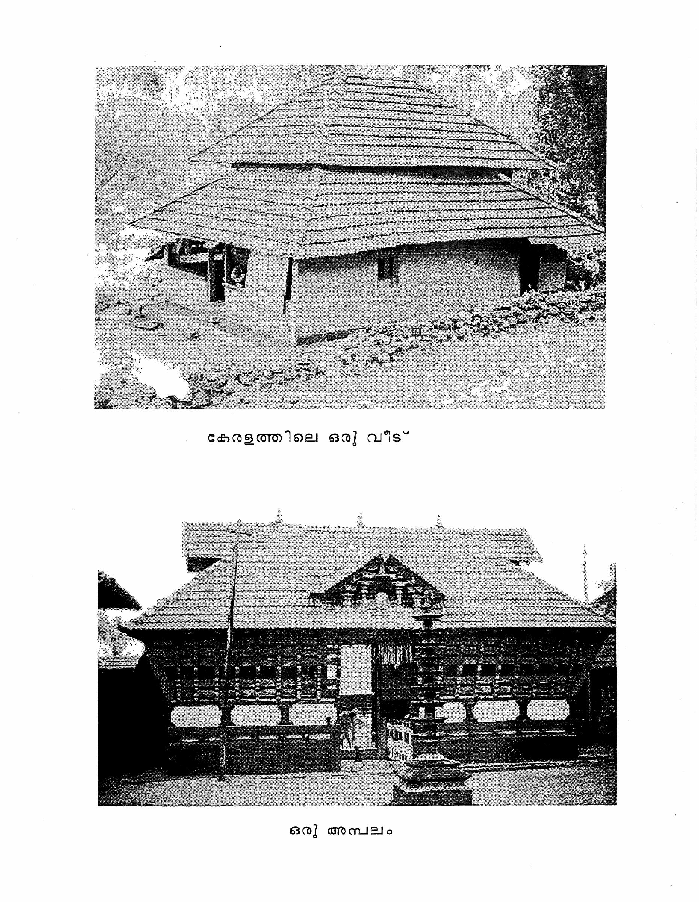
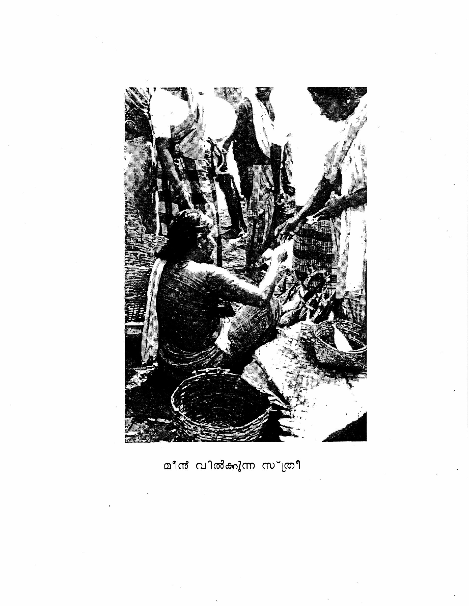

<!-- reading-anchor -->
# Lesson 19

<!-- Source: PDF page 325; printed page 268. -->

<!-- reading-anchor -->
## Vocabulary

| Malayalam | Meaning |
|---|---|
| മാനേജർ | manager |
| പ്യൂൺ | peon |
| പോയിരിക്കുകയായിരുന്നു | have (you) been |
| വെളിയിൽ | outside, out of doors |
| തിരക്ക് | crowd, pressure |
| ജോലിത്തിരക്കുള്ള | which has/have pressure of work |
| പോകരുത് | (you) mustn’t go, don’t go |
| ഭയങ്കര | awful, frightful |
| വിശക്കുക (past tense: വിശന്നു) | to be hungry (with dative subject, impersonal) |
| വിശപ്പ് | hunger |
| വല്ലതും | something |
| പുള്ളി | guy (colloq.) |
| ഇടക്കിടെ | periodically, regularly |
| ഇറങ്ങുക (past tense: ഇറങ്ങി) | to go out, to descend, to exit |
| പോകാറുണ്ട് | to be in the habit of going |
| ഓരോ കാരണങ്ങൾ | a different reason (every time) |
| കാരണം | reason |
| ഞാനാണ്--- ചെയ്യേണ്ടത് | I am the one who has to do ---. |
| ഓ! പിന്നെ | Is that so! (sarcastic) |
| ഓരോ കഥകൾ | a different story (each time) |
| ---ില്ലാത്തത് കൊണ്ട് | because of not --- |
| വിശ്വാസം | faith, belief |
| അയാളെ എനിക്ക് വിശ്വാസമുണ്ട് | I have faith in him |
| മടി | laziness |
| മടിയൻ | lazy fellow |
| മടിച്ചി | lazy person (feminine) |
| മടിയാണ് | (you) are lazy (with dative subject) |
| ജോലി ചെയ്യാൻ മടിയാണ് | reluctant, unwilling to do work (with dative subject) |
| <!-- Source: PDF page 326; printed page 269. --> ഏതായാലും | anyhow, in any case |
| ഇനിയും മുതൽ | from now on |
| അല്ലെങ്കിൽ | otherwise |
| മാറ്റുക (past tense: മാറ്റി) | to change (transitive) |
| സ്ഥലം മാറ്റുക | to transfer |
| എനിക്ക് നിങ്ങളെ സ്ഥലം മാറ്റേണ്ടതായി വരും | I will have to transfer you |
| സ്ഥലം മാറ്റരുതേ | please don’t transfer (me) (connotes pleading) |
| ചെയ്യാമേ | (I) will do (connotes submissiveness) |
| പ്രയാസം | difficulty |

<!-- reading-anchor -->
## Reading Practice

<!-- reading-anchor -->
### A.

Note how the noun ആളുകൾ “people” may be replaced in the following phrases by the plural relative pronoun അവർ “those who.”

1. ചായ കുടിക്കുന്ന ആളുകൾ.  
   ചായ കുടിക്കുന്നവർ.
2. വെളിയിൽ പോകുന്ന ആളുകൾ.  
   വെളിയിൽ പോകുന്നവർ.
3. കല്യാണം കഴിച്ച ആളുകൾ.  
   കല്യാണം കഴിച്ചവർ.
4. ഫോറം പൂരിപ്പിച്ച ആളുകൾ.  
   ഫോറം പൂരിപ്പിച്ചവർ.
5. സാറിനെ കാണണമെന്നുള്ള ആളുകൾ.  
   സാറിനെ കാണണമെന്നുള്ളവർ.

<!-- reading-anchor -->
### B.

Note how the nouns referring to male and female persons may be replaced in the following phrases by the singular relative pronouns അവൻ and അവൾ respectively. Note that respected female persons take the plural pronoun അവർ.

1. ദോശ കൊണ്ടുവന്ന പയ്യൻ.  
   ദോശ കൊണ്ടുവന്നവൻ.

<!-- Source: PDF page 327; printed page 270. -->

2. അവരുടെ വീട്ടിൽ ജോലി ചെയ്ത സ്ത്രീ.  
   അവരുടെ വീട്ടിൽ ജോലി ചെയ്തവൾ.
3. ഞങ്ങളെ പഠിപ്പിക്കുന്ന റ്റീച്ചർ.  
   ഞങ്ങളെ പഠിപ്പിക്കുന്നവർ.
4. പ്ലേറ്റ് കൊണ്ടുപോകുന്ന കുട്ടി.  
   പ്ലേറ്റ് കൊണ്ടുപോകുന്നവൻ.

<!-- reading-anchor -->
## Conversation

*മേനോൻ സാർ - മാനേജർ*  
*രാമൻ നായർ - ക്ലാർക്ക്*  
*തോമസ് - പ്യൂൺ*

**മേനോൻ:** തോമസേ, നിങ്ങൾ എവിടെ പോയിരിക്കുകയായിരുന്നു?

**തോമസ്:** വെറുതെ ഒന്നു വെളിയിൽ പോയതാ സാറേ.

**മേനോൻ:** ഇവിടെ ആഫീസിൽ വളരെ അധികം ജോലി ചെയ്യാനുണ്ടല്ലോ. ഇത്രയും ജോലിത്തിരക്കുള്ള സമയങ്ങളിൽ നിങ്ങൾ എന്റെ അനുവാദമില്ലാതെ വെളിയിൽ പോകരുത് എന്ന് ഞാൻ പറഞ്ഞിട്ടില്ലേ?

**തോമസ്:** ഭയങ്കര വിശപ്പുണ്ടായിരുന്നു സാർ. വല്ലതും ഒന്നു കഴിക്കാൻ പോയതാ സാറേ.

**നായർ:** ഈ പുള്ളി ഇടക്കിടെ ഇങ്ങനെ ഇറങ്ങി പോകാറുണ്ട് സാറേ. ഒരു ജോലിയും ചെയ്യുകയില്ല. എന്തെങ്കിലും ജോലി ചെയ്യാനുള്ള സമയത്ത് ഇങ്ങനെ ഓരോ കാരണങ്ങൾ പറഞ്ഞ് വെളിയിൽ പോകും. പിന്നെ ഞാനാണ് ജോലിയെല്ലാം ചെയ്യേണ്ടത്.

**തോമസ്:** ഓ പിന്നെ! ഈ രാമൻനായർ പറയുന്നത് ശരിയല്ല സാർ. അയാൾക്ക് എന്നെ ഇഷ്ടമില്ലാത്തത് കൊണ്ട് ഇങ്ങനെ ഓരോ കഥകൾ പറയുന്നതാണ്.

**മേനോൻ:** നായർ പറയുന്നത് ശരിയായിരിക്കും. അയാളെ എനിക്ക് വിശ്വാസമുണ്ട്. നിങ്ങൾ ഇങ്ങനെ ആയിരിക്കും സമയം മുഴുവനും കളയുന്നത്. നിങ്ങൾക്ക് ജോലി ചെയ്യാൻ മടിയാണെന്ന് തോന്നുന്നല്ലോ.

**തോമസ്:** അയ്യോ! ഇല്ല സാർ. എനിക്ക് ഒരു മടിയും ഇല്ല. എപ്പോഴും

<!-- Source: PDF page 328; printed page 271. -->

ഞാൻ ജോലി ചെയ്യാൻ തയ്യാറാണ്.

**മേനോൻ:** പക്ഷെ, അങ്ങനെയല്ല എനിക്ക് തോന്നുന്നത്. ഏതായാലും ഇനിയും മുതൽ ജോലി ചെയ്യേണ്ടതൊക്കെ ശരിയായിട്ടുള്ള സമയത്ത് ചെയ്യണം. അല്ലെങ്കിൽ എനിക്ക് നിങ്ങളെ സ്ഥലം മാറ്റേണ്ടതായി വരും.

**തോമസ്:** അയ്യോ! സാറേ! എന്നെ സ്ഥലം മാറ്റരുതേ! ഞാൻ ഇനിയും മുതൽ എല്ലാ ജോലിയും ശരിയായിട്ട് ചെയ്യാമേ!

<!-- reading-anchor -->
## Exercises

**1.** Change the following to negative commands as in the model.

Model: നീ ഇവിടെ ഇരിക്കണം. നീ ഇവിടെ ഇരിക്കു. നീ ഇവിടെ ഇരിക്കണ്ട.  
to, നീ ഇവിടെ ഇരിക്കരുത്.

1. നിങ്ങൾ അവിടെ പോകണം.
2. രാജൻ അത് ചെയ്യണ്ട.
3. നീ എന്റെ അടുത്ത് വരു.
4. പയ്യൻ ആ കാര്യം അയാളോട് പറയണം.
5. ഹമീദേ, നിങ്ങൾ ഇനിയും അവളെ കാണണ്ട.
6. ഗീതേ, നീ അമ്മയുടെ കൈയിൽ നിന്ന് പണം വാങ്ങിക്കു.
7. അമ്മേ, പഴയ കാര്യങ്ങൾ ഒന്നും ഓർക്കണ്ട.
8. ഇടത്തോട്ടുള്ള വഴിയിലേക്ക് തിരിയണം.
9. മോളേ, നീ അച്ഛനെ ഈ എഴുത്ത് കാണിക്കു.
10. അയാൾക്ക് ഒന്നും കൊടുക്കണ്ട.

**2. A.** Change the complex verbal adjectives in the phrases below to simple verbal adjectives.

Model: ഞാൻ കണ്ടിട്ടുള്ള സ്ഥലങ്ങളൊന്നും നിങ്ങൾ കണ്ടിട്ടില്ല.  
ഞാൻ കണ്ട സ്ഥലങ്ങളൊന്നും നിങ്ങൾ കണ്ടിട്ടില്ല.

1. മലയാളം പഠിച്ചിട്ടുള്ള കുട്ടികൾ ഈ പുസ്തകം വായിച്ചാൽ കൊള്ളാം.
2. ഞാൻ അയാൾക്ക് കൊടുത്തിട്ടുള്ള പണം പിന്നെ തരാമെന്ന് അയാൾ

<!-- Source: PDF page 329; printed page 272. -->

പറഞ്ഞു.

3. ഞാൻ ഇത് വരെ ചെയ്തിട്ടുള്ള കാര്യങ്ങളെല്ലാം മാനേജർക്ക് ഇഷ്ടമാണ്.
4. ഞാൻ അമേരിക്കയിൽ നിന്നും എന്റെ ഭാര്യക്ക് എഴുതിയിട്ടുള്ള കത്തുകളെല്ലാം അമ്മ വായിച്ചു.

**B.** Combine the two sentences in the pairs below using a locative plus -ഉള്ള.

Model: ആ മുറിയിൽ പല കസേരകൾ ഉണ്ട്. അവ ഇങ്ങോട്ട് കൊണ്ടു വരു.  
ആ മുറിയിലുള്ള കസേരകൾ ഇങ്ങോട്ട് കൊണ്ടുവരു.

1. ആ സിനിമാശാലയിൽ പല ആളുകൾ ഉണ്ട്. അവരിൽ നൂറു പേർ കേരളീയരാണ്.
2. ആ ആഫീസിൽ ഒരു ക്ലാർക്ക് ഉണ്ട്. അയാളുടെ കൈയിൽ ഈ ഫോറം കൊടുക്കണം.
3. അയാളുടെ കൈയിൽ ഒരു പുസ്തകം ഉണ്ട്. അത് എന്റേതായിരിക്കും.
4. എന്റെ വീടിന്റെ മുന്നിൽ ഒരു വലിയ കടയുണ്ട്. അത് ഒരു തുണിക്കട ആണ്.

**C.** Rewrite the sentences below changing the noun phrases which are underlined to include -ഉള്ള as in the model.

Model: ആ <u>തുണിക്കട</u> അറിയില്ലേ? ആ തുണിയ<u>ുള്ള</u> കട അറിയില്ലേ?

1. കോഴിക്കോട് ഒരു വലിയ <u>തുറമുഖപട്ടണം</u> ആണ്.
2. ഇത് ഒരു <u>എളുപ്പകാര്യമാണ്</u>.
3. എനിക്ക് ഒരു <u>ആവശ്യകാര്യ</u>ത്തിനെ പറ്റി അദ്ദേഹത്തിനോട് ഒന്നു സംസാരിക്കണം.
4. ഒരു <u>സന്തോഷവാർത്ത</u> കേട്ടോ. ഞാൻ ഇന്ന് ഒരു അച്ഛനായി.

**3. A.** Create new sentences from the following by nominalizing the desiderative verbforms and adding the copula as in the model.

Model: നിങ്ങൾ അത് ചെയ്യണം.  
നിങ്ങൾ അത് ചെയ്യേണ്ടതാണ്.

<!-- Source: PDF page 330; printed page 273. -->

1. നിങ്ങൾ ഇങ്ങനെ ചെയ്യണം.
2. ഇതിന് തോമസ് സാറിനോട് അനുവാദം ചോദിക്കണം.
3. മോളേ, നീ അമേരിക്കക്ക് പോകുന്നതിന് മുമ്പ് പള്ളിയിലെ അച്ഛനെ ഒന്നു കാണണം.
4. രമ അവിടെ പോകണമെന്ന് അദ്ദേഹം പറഞ്ഞു.
5. എന്നും പത്രം കൊണ്ടുവരുന്നതിന് ഈ പയ്യന് ആഴ്ചയിൽ രണ്ടു രൂപ കൊടുക്കണം.

**B.** Make cleft sentences again, this time by placing the ആണ് after the underlined word and changing the verb accordingly.

Model: <u>ഞാൻ</u> അതെല്ലാം ചെയ്യണം.  
ഞാനാണ് അതെല്ലാം ചെയ്യേണ്ടത്.

1. <u>അച്ഛൻ</u> അമ്മയെ ആശുപത്രിയിൽ കൊണ്ടുപോകണം.
2. <u>സാർ</u> അവളെ മലയാളം പഠിപ്പിക്കണം.
3. <u>മാനേജർ</u> അയാളോട് ജോലി ശരിയായിട്ട് ചെയ്യാൻ പറയണം.
4. എന്നെ <u>കാണിച്ചിട്ട്</u> അയാൾക്ക് കൊടുക്കണം.
5. നിങ്ങൾ <u>അദ്ദേഹത്തിനെ</u> പോയി കാണണം.

**C.** Combine the sentences in the pairs below by making the first into an adjective phrase as in the model.

Model: എനിക്ക് ഒരു സാരി വാങ്ങിക്കണം. ആ സാരി ഈ കടയിലില്ല.  
എനിക്ക് വാങ്ങിക്കേണ്ട സാരി ഈ കടയിലില്ല.

1. നിങ്ങൾ ഒരു ജോലി ചെയ്യണം.  
   അത് ചെയ്യാൻ എളുപ്പമാണ്.
2. രാമന് ആ പുസ്തകം വായിക്കണം.  
   അത് നല്ല മലയാള പുസ്തകമാണ്.
3. എന്റെ മകൾക്ക് ഒരു സിനിമ കാണണം.  
   അത് ഈ സിനിമാശാലയിലാണ് നടക്കുന്നത്.
4. നിങ്ങൾ ഒരു ഫോറം പൂരിപ്പിക്കണം.  
   ആ ഫോറം ഈ ആഫീസിൽ കിട്ടും.
<!-- Source: PDF page 331; printed page 274. -->

5. എനിക്ക് ചേട്ടനോട് ഒരു കാര്യം പറയണം. അത് ചേച്ചി കേൾക്കരുത്.
6. ജെയിംസേ, കമലയെ ഒരു ഡാക്ടറിനെ കാണിക്കാൻ കൊണ്ടു പോകണം. അയാളുടെ പേര് കേശവൻ നായർ എന്നാണ്.

**4. A.** Combine the sentences in the pairs below by making the first into a dependent ‘because’ clause as in the model.

**Model:** അവർ ഇന്ന് ഇവിടെ വരുന്നു.  
അത് കൊണ്ട് ഞാൻ അവിടെ പോകുന്നില്ല.  
അവർ ഇന്ന് ഇവിടെ വരുന്നത് കൊണ്ട് ഞാൻ അവിടെ പോകുന്നില്ല.

1. അച്ഛനെ ഞാൻ ഇന്ന് ആശുപത്രിയിൽ കൊണ്ടുപോയി. അത് കൊണ്ട് ഇപ്പോൾ അച്ഛന് സുഖമുണ്ട്.
2. ഞാൻ കുറച്ച് മുമ്പ് ചായകുടിച്ചു. അത് കൊണ്ട് ഇപ്പോൾ കാപ്പി വേണ്ട.
3. നമ്മൾ വേഗം നടക്കുന്നു. അത് കൊണ്ട് നേരത്തെ ബസ്സ്റ്റാൻഡിൽ എത്തും.
4. മീറ്റിങ്ങ് നേരത്തെ കഴിഞ്ഞു. അത്കൊണ്ട് എനിക്ക് ഇപ്പോൾ വീട്ടിൽ പോകാം.
5. അയാൾ ജോലിയെല്ലാം ശരിയായിട്ട് ചെയ്യുന്നു. അത് കൊണ്ട് സാറിന് സന്തോഷമാണ്.

**B.** Combine the sentences in the pairs as in A above changing ഉണ്ട് to ഉള്ള.

**Model:** എനിക്ക് അയാളെ വിശ്വാസമുണ്ട്.  
അത് കൊണ്ട് ഞാൻ അയാൾക്ക് ഒരു ജോലി കൊടുത്തു.  
എനിക്ക് അയാളെ വിശ്വാസമുള്ളത് കൊണ്ട് ഞാൻ അയാൾക്ക് ഒരു ജോലി കൊടുത്തു.

1. രാമന് വളരെ അധികം ജോലിയുണ്ട്. അത് കൊണ്ട് അയാൾ വരുന്നില്ല.
2. ഹമീദിന് നാളെ ഒരു പരീക്ഷയുണ്ട്. അത് കൊണ്ട് അയാൾ വീട്ടിൽ നിന്നും ഇറങ്ങുകയില്ല.

<!-- Source: PDF page 332; printed page 275. -->

3. മകൾക്ക് ധാരാളം പണമുണ്ട്. അതുകൊണ്ട് അവൾക്ക് എല്ലാം വാങ്ങിക്കാം.
4. എനിക്ക് കുറച്ച് സമയമുണ്ട്. അത് കൊണ്ട് ഞാൻ ഒരു പുസ്തകം വായിക്കാൻ പോകുകയാണ്.
5. ഈ വഴിയിൽ നല്ല തിരക്കുണ്ട്. അത് കൊണ്ട് വേഗം നടക്കാൻ പറ്റുകയില്ല.

**5.** Translate into Malayalam.

1. This is the one he wants.
2. The manager feels that I am the one to write the letter.
3. It’s the peon who wastes all the time in this office.
4. I have no faith in him at all.
5. Anyway, I am ready to transfer him right now, if he wishes.
6. At times when there is no work to do you may go out after telling the clerk only, but at times when there’s work to do, you must stay here; have you got that?
7. Since we had run out of meat, I had sent Mani to the market.
8. The children (habitually) arrive at the school at eight o’clock.
9. I never tell any stories at all. You know that.
10. I am the one who has to complete this form. You don’t have to complete anything, so don’t take this pen.

**6.** Read the following making sure you understand the meaning.

1. നിങ്ങൾ ഇങ്ങനെ വെറുതെ സമയം കളഞ്ഞാൽ മാനേജർ വിചാരിക്കും നിങ്ങൾക്ക് ജോലി ചെയ്യാൻ മടിയാണെന്ന്.
2. ചേട്ടൻ ഇന്നലെ അമ്മയെ കാണാൻ കൊച്ചിക്ക് പോയി. ഞാനും പോകേണ്ടതായിരുന്നു. പക്ഷെ എനിക്ക് സുഖമില്ലാത്തതുകൊണ്ട് ഞാൻ പോയില്ല.
3. എനിക്ക് കാറില്ലാത്തത്കൊണ്ട് എന്റെ കുട്ടികൾ നടന്നാണ് സ്കൂളിൽ പോകുന്നത്.
4. A. “മോളേ, നീ ഈ തുണി കൃഷ്ണാസാരിക്കടയിൽ നിന്നായിരിക്കും വാങ്ങിച്ചത്. അല്ലേ!”  
   B. “അതെ. ഇതു പഴയതായിരിക്കും. അയാൾ നിന്നെ കളിപ്പിച്ചു എന്ന് തോന്നുന്നു.”

<!-- Source: PDF page 333; printed page 276. -->

5. ഈ പയ്യൻ എവിടെ പോയിരിക്കുകയാണ്? ജോലി ചെയ്യാനുള്ള സമയത്ത് അവനെ കാണുകയില്ല. ഇങ്ങനെ ഇറങ്ങിപ്പോകരുത് എന്ന് ഞാൻ അവനോട് എപ്പോഴും പറയുന്നതാണ്.
6. ഹമീദ് മിക്കവാറും കമലയെ പോയി കാണാറുണ്ട്. ഹമീദിന് അവളെ വലിയ ഇഷ്ടമാണെന്ന് തോന്നുന്നു. എനിക്ക് തോന്നുന്നത് അവർ അവളെ കല്യാണം കഴിക്കുമെന്നാണ്.
7. രാജൻ ഇടക്കിടെ കോട്ടയത്ത് വരാറുണ്ട് അല്ലേ? ഒരു ദിവസം എന്നെ ഒന്നു വന്നു കാണാൻ പറയു.
8. A. “അമ്മേ, എനിക്ക് വിശക്കുന്നു. കഴിക്കാൻ വല്ലതും തരൂ.”  
   B. “ദോശ ഉണ്ടാക്കി തരട്ടെ.”  
   A. “കൊള്ളാം. പക്ഷെ, ചമ്മന്തിയില്ലാതെ വേണ്ട.”  
   B. “ശരി, എന്നാൽ രണ്ടുംതരാം.”
9. എനിക്ക് വേണ്ടത് നിന്റെ കൈയിലുണ്ടോ?
10. ഓരോ ജോലിക്കും ഓരോ ഫോറം പൂരിപ്പിച്ചു കൊടുക്കണം.

**7.** Rewrite the following sentences with ഏ form.

**Model:** മോളേ, വീഴാതെ നോക്കണം.  
മോളേ, വീഴാതെ നോക്കണേ!

1. എനിക്ക് ആ പുസ്തകം തരണം.
2. നിങ്ങൾ ഈ ജോലി ചെയ്യണം.
3. ഗീതേ, ജോണിനെ വിളിക്കണം.
4. നീ കാപ്പി കുടിച്ചിട്ട് അമ്പലത്തിൽ പോകണം.
5. കൃഷ്ണാ, നീ എന്നും പത്രം വായിക്കണം.
6. വീട്ടിൽ പോയി ഈ ബുക്ക് വായിച്ച് നോക്കണം.
7. എല്ലാ വാർത്തകളും എന്നോട് പറയണം.
8. ഇന്നലെ ഞാൻ പറഞ്ഞ കാര്യം ശരിയാക്കണം.
9. ഈ ഫോറം സാറിനെ ഒന്ന് കാണിക്കണം.
10. ചേച്ചിയോട് ചോദിക്കണം.
<!-- Source: PDF page 334; printed page 277. -->

<!-- reading-anchor -->
## Grammar Notes

<!-- reading-anchor -->
### 19.1 Mildness and Deference During Confrontation

This lesson’s conversation exemplifies some of the verbal devices used in Malayalam to moderate the effects of unpleasant things which must be said. Every so often, the office manager makes sure to soften his critical statements of the peon through the use of the politeness marker -അല്ലോ (see [6.1](lesson6.md#section-6-1)). This sometimes adds a tone of mildness, hard to represent by words in English, and sometimes directly softens the force of a statement. Witness:

1. ഇവിടെ ആഫീസിൽ വളരെ അധികം ജോലി ചെയ്യാനുണ്ടല്ലോ.

   “There (really) is a great deal to do here in the office.”
2. നിങ്ങൾക്ക് ജോലി ചെയ്യാൻ മടിയാണെന്ന് തോന്നുന്നല്ലോ.

   “I am afraid you have an aversion to work.”

The manager tones down two of his (her) statements by using a verb showing probability, ആയിരിക്കും, instead of the more definitely assertive ആണ്. Greater doubt could have been shown by using ആയിരിക്കാം, “may.” Witness:

3. നായർ പറയുന്നത് ശരി ആയിരിക്കും / ആയിരിക്കാം.

   “What Nair says is probably, must be right/ may be right.”
4. നിങ്ങൾ ഇങ്ങനെയായിരിക്കും സമയം മുഴുവൻ കളയുന്നത്.

   “It’s probably so that you are wasting (your) time totally.”

The manager also makes some of his criticisms less direct by putting them into a carrier sentence with തോന്നുന്നു, “I think” (see [15.5](lesson15.md#section-15-5)), thus placing them within the realm of opinions rather than facts. Witness example 2 above and also:

5. പക്ഷെ, അങ്ങനെയല്ല എനിക്ക് തോന്നുന്നത്.

   “But I don’t think that’s so.”

For his part, the peon also tries to soften his retorts to the manager’s questions and criticisms. Firstly, he uses the softener ഒന്ന് to show deference. Also the use of the nonemphatic order in cleft sentences (see [15.1](lesson15.md#section-15-1)) gives his statements a milder, less assertive tone. Witness:

<!-- Source: PDF page 335; printed page 278. -->

6. വെറുതെ ഒന്നു വെളിയിൽ പോയതാ സാറേ.

   “I just went out, that’s all” (note that വെറുതെ does not mean here “for no purpose” in the specific sense but rather carries the idea of “happened to”)
7. വിശന്നിട്ട് വല്ലതും ഒന്നു കഴിക്കാൻ പോയതാ സാറേ.

   “I got hungry, and just went to eat something, sir.”

On the other hand, the peon does nothing to soften the categorical statements he makes about his good qualities, and lack of bad ones. He does, however, when confronted with the sudden prospect of being transferred, add a pleading, submissive tone to his final statement by adding -ഏ to the verbform (see [23.6](lesson23.md#section-23-6)). Witness:

8. എനിക്ക് ഒരു മടിയും ഇല്ല. എപ്പോഴും ഞാൻ ജോലി ചെയ്യാൻ തയ്യാറാണ്.

   “I am not one bit lazy; I am always ready to do the work.”
9. ഞാൻ ഇനിയും എല്ലാ ജോലിയും ശരിയായിട്ട് ചെയ്യാമേ.

   “From now on I will do all tasks well” (pleadingly).

<!-- reading-anchor -->
### 19.2 The Familiar/Forceful Negative Command Form

The strongest type of negative command possible in Malayalam is made by adding -അരുത് to the present verbstem. Note that all forms with -അരുത് are regular without exception. While this type of command form tends to be used more with persons with whom നീ is permitted, (hence the title “familiar negative command”), its use is broader than this. Since one of the components of its meaning is a forceful tone, it can be used with persons with whom only നിങ്ങൾ is permitted, and even to social superiors, when the situation warrants. The peon, for instance, lowest on the office social hierarchy, is able to use it with the office manager to convey the strength of his feelings when he says:

1. അയ്യോ സാറേ, എന്നെ സ്ഥലം മാറ്റരുതേ.

   “Good lord, sir, don’t transfer me.”

The milder negative command form മാറണ്ട (see [17.4](lesson17.md#section-17-4)) would simply not be forceful enough for the peon’s present purposes.

<!-- Source: PDF page 336; printed page 279. -->

<!-- reading-anchor -->
### 19.3 Summing Up the Uses of the Verbal Noun in -അത്

So far, you have seen verbal nouns primarily in cleft sentences (see [11.2](lesson11.md#section-11-2) and 15.1) and as objects of postpositions (see [12.4](lesson12.md#section-12-4)). This lesson’s conversation provides a representative sample of some of these, plus other usages alluded to in earlier grammar notes. The cleft sentences with unemphatic order have already been cited in Examples 6 and 7 in [19.1](lesson19.md#section-19-1) above. In addition, there are two examples of cleft sentences with normal, emphatic order, c.f.:

1. പിന്നെ ഞാനാണ് ജോലിയെല്ലാം ചെയ്യേണ്ടത്.

   “Then it is me who has to do all the work.”

Another is cited in Example 4 of 19.1.

In two other examples, the verbal noun is used to make a clause into a phrase so that it may then serve a functional role within another sentence. Witness:

2. ഈ രാമൻ നായർ പറയുന്നത് ശരിയല്ല സാർ.

   “What this Raman Nair says is not true, sir.”
3. നായർ പറയുന്നത് ശരിയായിരിക്കും.

   “What Nair says is probably right.”

Note that this same process occurs with cleft sentences. The only difference is that the part of the sentence following the word to be emphasized or focused is made into a noun phrase, and its functional role is to serve as the predicate, not the subject of the sentence. Nominalized sentences may also serve a variety of case roles within a larger sentence, in which case they bear the ending appropriate to that role--dative, locative, or what have you. These are exemplified in [15.6](lesson15.md#section-15-6). Verbal nouns also take dative, locative, and other endings when governed by a postposition. No examples occur in this lesson’s conversation, but those in [12.4](lesson12.md#section-12-4) should suffice. Finally, there is one example of a verbal noun being used in the functional role of adverb, with the adverb marker ആയി. Witness:

4. അല്ലെങ്കിൽ എനിക്ക് നിങ്ങളെ സ്ഥലം മാറ്റേണ്ടതായി വരും.

   “Otherwise, it may become necessary for me to transfer you.”

This usage will be treated in [24.6](lesson24.md#section-24-6).

> **Editorial source note:** Section [24.6](lesson24.md#section-24-6) discusses ability and inability, rather than fully developing the obligation construction promised here. Treat the translated examples in this section as the available guidance.

<!-- Source: PDF page 337; printed page 280. -->

<!-- reading-anchor -->
### 19.4 The Repetitive Verbform with -ാറുണ്ട്

True habitual action and general truth is handled by the -ഉം verb ending covered in [7.1](lesson7.md#section-7-1), and sometimes by the simple present ending -ന്നു, particularly in writing. A verbform is introduced in this lesson which serves for cases of repeated action over time, but which can be regarded as habitual. This concept is usually expressed in English by “has been...” in the present orientation and by “had been...” or “used to...” in the past timeframe. Witness:

1. അയാൾ ഇടക്കിടെ ഇങ്ങനെ ഇറങ്ങി പോകാറുണ്ട് സാറേ.

   “He has been going out like this from time to time, sir.”
2. ഞാൻ അയാളുടെ മകനെ പഠിപ്പിക്കാറുണ്ട്.

   “I have been teaching his son.”

This verbform is put into the past by using ഉണ്ടായിരുന്നു. It may also occur as a supposition with probability expressed by the desiderative ഉണ്ടായിരിക്കണം. See:

3. ഒരാഴ്ച മുഴുവൻ ഞങ്ങൾ വെളിയിൽ ഹോട്ടലിൽ കഴിക്കാറുണ്ടായിരുന്നു.

   “For a whole week we were eating out of hotels.”
4. വേലക്കാരൻ എന്നും കുറച്ച് പണം എടുക്കാറുണ്ടായിരിക്കണം.

   “The servant must have been taking a little money every day.”

The present verbstem plus -ാർ- is also used with ആയി to make a verbform expressing the idea of “about to...” (see [22.6](lesson22.md#section-22-6)).

<!-- reading-anchor -->
### 19.5 Negative Verbal Adjectives and Nouns

In Lesson Eighteen you learned the negative conjunctive verbform (see [18.4](lesson18.md#section-18-4)). These forms, ending in -ാതെ, are grammatically adverbs. They may be made into adjectives by doubling the consonant of the ending and changing the എ to the adjectival marker -അ. See:

1. വേണ്ടാത്ത കാര്യങ്ങൾ.

   “unwanted matters.”
2. സ്കൂളിൽ പോകാത്ത കുട്ടികൾ.

   “Children who don’t go to school.”
<!-- Source: PDF page 338; printed page 281. -->

These should be regarded, like their positive counterparts (see [8.2](lesson8.md#section-8-2), 13.5, 15.3), as relative clauses.

Once a negative verbform has been made into an adjective, it may then be made into a noun by the normal process of adding -അത്. They may then be used in any functions which a noun phrase may serve, including the object of a postposition, c.f.:

3. എന്നെ ഇഷ്ടമില്ലാത്തത് കൊണ്ട് — “because of not liking me” (literally, because that he does not like me)
4. എന്ത് കൊണ്ടാണ് നിങ്ങൾ പോകാത്തത് — “Why aren't you going?” (literally, because of what is it that you are not going).

Positive verbal adjectives, and nouns made from them, may show either present or past tense, depending on which verbstem they are made from (see [8.2](lesson8.md#section-8-2) and 13.5 respectively). Negative adjectives and nouns also have present and past forms. The present verbform ends in -ാതെ (see [18.4](lesson18.md#section-18-4)), while the past negative verbal base ends in ആഞ്ഞ്. It is possible to show the contrast between present and past in negative verbal adjectives and nouns through the use of a complex tense using the auxiliary verb ഇരിക്കുക. Witness:

5. നീ അയാളെ ക്ഷണിക്കാതെ ഇരിക്കുന്നത് ശരിയല്ല. — “It's not good that you are not inviting him.”
6. നീ അയാളെ ക്ഷണിക്കാതെ ഇരുന്നത് ശരിയല്ല. — “It's not good that you didn't invite him.”

In these examples, ഇരിക്കുക is brought in as the main verb of a carrier sentence which can show tense, and the negative sentence is embedded within it, with the negative verb taking the form of an adverb with the ending -ാതെ. Colloquially, there is an alternative means of expressing a negative verbal noun in the past without a carrier sentence. Thus example 6 above could also be rendered as:

7. നീ അയാളെ ക്ഷണിക്കാഞ്ഞത് ശരിയല്ല. — “It's not good that you didn't invite him.”

<!-- Source: PDF page 339; printed page 282. -->

8. നീ അയാളുടെ കൂടെ പോകാഞ്ഞത് ശരിയല്ല. — “It's not good that you didn't go with him.”

Like the other negative endings, ആഞ്ഞ് is added to the present verbal stem. It frequently occurs with the conditional marker -ാൽ, usually with a sense of warning of bad consequences if something is not done. Note that in such cases there is no actual past tense meaning, rather the past negative is used in a hypothetical sense, just as in English when we say “If you wouldn't show up on time, you would be fired”. Further, unlike -ാതെ, ആഞ്ഞ് can occur with perfective marker -ിട്ട്. Witness:

<!-- Editorial correction: PDF page 339 has മാറേണ്ട; the transitive meaning “transfer you” requires മാറ്റേണ്ട, as in this lesson’s conversation. -->
9. ജോലി ചെയ്യാഞ്ഞാൽ നിങ്ങളെ സ്ഥലം മാറ്റേണ്ടതായി വരും. — “If you don't do the work, I will have to transfer you.”
10. ജോലി ചെയ്യാഞ്ഞിട്ടാണ് നിങ്ങളെ പിരിച്ചുവിടുന്നത്. — “It's because you haven't done the work, that you are being terminated.”

It is further possible, as with all adjectives, to add the human relative pronouns as well, to negative verbal adjectives in order to form relative clauses. Witness:

11. ഞാൻ ഒരു ജോലിയില്ലാത്തവനാണ്. — “I am unemployed” (literally, I am one who is unemployed).
12. ജോലി ചെയ്യാത്തവരെ സ്ഥലം മാറ്റും. — “Those who don't work will be transferred.”
13. ആ സ്ത്രീ ഒന്നും അറിയാത്തവൾ ആണ്. — “That woman doesn't know anything.” (This can refer either to innocence or ignorance).

Positive relative clauses with these pronouns are treated in the following section.

<!-- reading-anchor -->
### 19.6 Relative Clauses with Personal Relative Pronouns

Section [15.3](lesson15.md#section-15-3) discussed relative clauses. These are embedded sentences which function as adjectives. They maintain the original order of elements within them, but instead of one of the normal verb endings their verb must carry the adjective marker -അ, which can only be attached to the simple present or to the simple past verbforms. Most of the relative clauses in Lesson Fifteen described people, hence had a word denoting a person, or persons, as the <!-- Source: PDF page 340; printed page 283. --> headword of the noun phrase of which the relative clause is a part. It is also possible to make such noun phrases using a personal pronoun as the headword. In such cases, the pronoun is attached directly to the verbal adjective.

Section A of this lesson's Reading Practice contains a set of examples where the plural pronoun -വർ “those who” is substituted for the head noun ആളുകൾ “people.” Section B shows examples where the singular feminine pronoun -വൾ “she who” and the singular male pronoun -വൻ “he who” take the place of nouns denoting female and male referents. These, of course are very much like the noun phrases which are made from a relative clause plus the neuter pronoun -അത് “that which.” Note that Malayalam has no separate item equivalent to the English relative pronouns “who,” “which,” or “that.” The personal pronouns -വർ, -വൾ, and -വൻ may be called relative pronouns since they occur only with relative clauses. Noun phrases consisting of a relative clause and a personal pronoun headword are much more common in Malayalam than in English. Should you be translating Malayalam into English, for a research paper, literary publication, or whatever, you will have to treat such noun phrases loosely rather than according to strict word for word equivalence.

Witness:

1. സ്കൂളിൽ പോകാത്തവർ — “those who are not attending school.”
2. കല്യാണം കഴിച്ചവർ — “Those who are married” (literally, those who have completed marriage)
3. ആ സാറിന്റെ കൂടെ ഇരിക്കുന്നവൾ — “the lady, girl sitting with that gentleman”
4. ഇപ്പോൾ വെളിയിൽ പോയവൻ — “the person (male) who has just gone out”

Several types of clauses are relativized through the use of -ഉള്ള. Firstly, those whose main verb is ഉണ്ട് as in:

5. ജോലിയുള്ളവർ — “those who have jobs”

Secondly, sentences containing verbforms other than simple present or past must be embedded in a carrier sentence whose main verb is ഉണ്ട് whose adjectival form is -ഉള്ള. Witness:

<!-- Source: PDF page 341; printed page 284. -->

6. എന്നോട് വല്ലതും ചോദിക്കണമെന്നുള്ളവർ — “those who want to ask me something.”

Noun phrases comprised of a relative clause plus a relative pronoun may serve all of the functions which ordinary nouns serve in a sentence. They may be the subject or predicate, as they stand. They may become adverbs with the addition of the adverb marker -ആയി (see [22.5](lesson22.md#section-22-5)). They may also serve various case roles, with the addition of the appropriate dative, accusative, possessive, or other ending.

<!-- reading-anchor -->
### 19.7 The Present Perfect Verbform

Section [13.1](lesson13.md#section-13-1) treats the stative perfect verbform which may initially appear very similar to the present perfect. The two verbforms are actually quite distinct in form and function.

**Forms:** The present perfect is made from the conjunctive plus the auxiliary verb ഇരിക്കുക in one of several forms. The present tense and present progressive endings on the auxiliary are most common. Witness:

1. അവർ വന്നിരിക്കുന്നു. — “They have come.”
2. അയാൾ ടിക്കറ്റ് വാങ്ങിക്കാൻ പോയിരിക്കുകയാണ്. — “He has gone to buy the tickets.”

**Functions:** The fact that the English translations are identical leads one to think that the stative and present perfect forms are identical in meaning. Actually, the two forms are complementary in most usages, and distinct in meaning under most conditions. They both report the same action but with different emphases. Thus Example 1 above and Example 3 below report that some people have come and that they are still present. Example 1 however indicates that they have just arrived while Example 3 emphasizes the new situation brought about by their arrival. In some instances the present perfect indicates that the effects of the action, rather than the action itself, have just occurred. Thus example 17 below, depending on the situation, indicates either that the letter has just been received, or that it had just been written, while 18 emphasizes the fact that the letter has been completed and is now in existence.

<!-- Source: PDF page 342; printed page 285. -->

3. അവർ വന്നിട്ടുണ്ട്. — “They have come.”
4. അയാൾ ടിക്കറ്റ് വാങ്ങിക്കാൻ പോയിട്ടുണ്ട്. — “He has gone to buy the tickets.”

Similarly, Example 2 and Example 4 report the same event but have different implications. Example 2 with the present perfect implies that the person is not here at the moment, while Example 4 would tend to be used to indicate that someone else has gone to buy tickets, hence the matter has been taken care of. This is true, since the stative perfect which contains the perfective marker -ിട്ട് emphasizes the completion of the action or process.

Thus it may be seen that the present perfect refers to the present condition only, whereas the stative perfect often indicates a change of condition. Thus the present perfect in example 5 says only that the person is sleeping, while example 6 reports a change of state from not sleeping to sleep.

5. അവൾ ഉറങ്ങിയിരിക്കുന്നു. — “She is asleep”.
6. അവൾ ഉറങ്ങിയിട്ടുണ്ട്. — “She has gone to sleep.”

The two forms are very different in terms of their use in questions. Firstly, the present perfect is preferred in information type questions, i.e. those containing a question word, as in:

7. അവർ ഏത് ഹോട്ടലിൽ കയറിയിരിക്കുന്നു? — “Which hotel did they enter, have they entered?”
8. അവർ അയാളെ എന്തിന് അയച്ചിരിക്കുന്നു? — “Why has she sent him?”

In terms of yes-no questions, only the stative perfect (-ിട്ടുണ്ട്) form can be used to express “have... ever ...” questions (see [13.1](lesson13.md#section-13-1)). The present perfect, on the other hand, is used to inquire about a specific event pursuant to some topic already introduced into the discourse and which has taken place in the very immediate past. Witness:

<!-- Source: PDF page 343; printed page 286. -->

9. അവർ ആ ഹോട്ടലിൽ കയറിയിരിക്കുന്നോ? — “Have they gone into that hotel?”

It will be further recalled, that the -ിട്ടുണ്ട് form is used for stative expressions in statements as well as yes-no questions such as:

10. കറി വെച്ചിട്ടുണ്ട് or കറി ഉണ്ടാക്കിയിട്ടുണ്ട്. — “The curry is made.”
11. ഇന്ന് എല്ലാ കടകളും അടച്ചിട്ടുണ്ട്. — “All the shops are closed today.”

The present perfect cannot be used at all in such expressions.

When adverbs denoting past time are used, the -ിട്ടുണ്ട് verbform may be used interchangeably with the simple past, c.f.:

12. അയാൾ ഇതിനു മുമ്പ് ഇവിടെ വന്നിട്ടുണ്ട്. — “He came here before.”

The present perfect may not be used with past time adverbials at all, only with those denoting the present, in which case it is interchangeable with the stative perfect. Witness:

13. അയാൾ ഞങ്ങളെ ഇപ്പോൾ അറിയിച്ചിരിക്കുന്നു. അയാൾ ഞങ്ങളെ ഇപ്പോൾ അറിയിച്ചിട്ടുണ്ട്. — “He has just now informed us.”

Finally, the present perfect may, though it seems a contradiction, take the progressive aspect (see [21.6](lesson21.md#section-21-6)), whereas the -ിട്ടുണ്ട് form may not. Adding the progressive aspect indicates that the results of the action, rather than its completion, are in focus, and that these results are still in force. Witness:

14. സാർ ഇപ്പോൾ വെളിയിൽ പോയിരിക്കുകയാണ്. — (literally, the boss has just gone out, but best rendered), “the boss is out right now.”

Not all verbs may take the progressive aspect in their present perfect form in this way.

<!-- Source: PDF page 344; printed page 287. -->

Many verbs represent a single action with no continuing results to them. Note also that the progressive aspect form may also be put into the past when the focus is on the results of an action in the immediate past. It is for this reason that the office manager in this lesson's conversation elects to use the past progressive form in asking the peon:

15. നിങ്ങൾ എവിടെ പോയിരിക്കുകയായിരുന്നു? — (literally, where have you gone, but best rendered), “where have you been?”

The present perfect tense is also used for some cases where “leave” is used in English. c.f.:

16. ജനൽ തുറന്നിരിക്കട്ടെ? — “Shall I leave the window open?”
17. രവി എഴുത്ത് എഴുതിയിരിക്കുന്നു. — “Ravi has written a letter”. i.e. “Ravi has just finished writing a letter” or “I just got a letter from Ravi”.
18. രവി എഴുത്ത് എഴുതിയിട്ടുണ്ട്. — “Ravi has written a letter”. i.e. the letter has been written.

<!-- reading-anchor -->
### 19.8 Statements and Commands Using the Double Negative

Like English, Malayalam can use a double negative to make a positive statement. The negative conjunctive verbform is used for the first of the two negatives. Witness:

1. അദ്ദേഹം പറഞ്ഞതിൽ കാര്യം ഇല്ലാതില്ല. — “There is some substance in what he says.” literally: “What he says, is not without substance (or sense).”

A further common use of the double negative has no English parallel. Here, the negative conjunctive is embedded in a carrier sentence having the verb ഇരിക്കുക, c.f.:

<!-- Editorial correction: PDF page 344 mistranslates the double negative as “He will certainly not come.” -->
2. അവൻ വരാതിരിക്കില്ല. (വരാതെ ഇരിക്കില്ല) — “He will certainly come.” literally, “He will not remain without coming.”
3. ഈ കുട്ടികൾ തർക്കിക്കാതിരിക്കില്ല. — “These children are always fighting.” literally, “These children are (habitually) not not quarreling.”

<!-- Source: PDF page 345; printed page 288. -->

This same construction may be used for commands. Note how the positive makes a negative command, and the negative makes a positive one.

4. കുട്ടികളേ തർക്കിക്കാതിരിക്കു. — “Children, don't fight.” literally, “be not fighting.”
5. കുട്ടികളേ പാടാതിരിക്കണ്ട. — “Children, you'd better sing.” literally, “don't be not singing.”

<!-- Source: PDF page 346; unnumbered photograph page. -->

കേരളത്തിലെ ഒരു വീട്

ഒരു അമ്പലം

<!-- Source: PDF page 347; unnumbered photograph page. -->

മീൻ വിൽക്കുന്ന സ്ത്രീ

<!-- reading-navigation -->

---

[← Previous: Lesson 18](lesson18.md) · [Contents](contents.md) · [Next: Lesson 20 →](lesson20.md)

<!-- /reading-navigation -->
