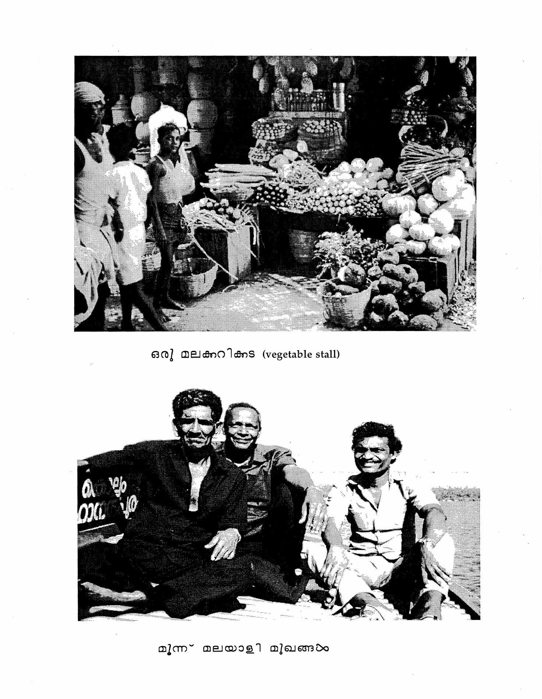
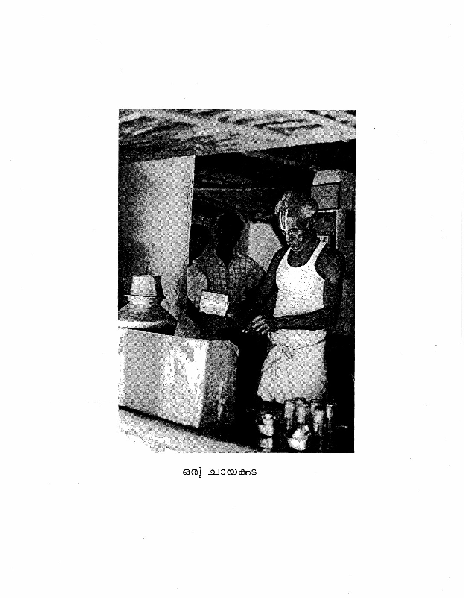

<!-- Source: PDF page 72; printed page 26. -->
<!-- reading-anchor -->
# Lesson 3

<!-- reading-anchor -->
## Reference List

<!-- reading-anchor -->
### Demonstratives

| Type | Malayalam | English |
|---|---|---|
| Pronouns | ഇത് | this, this one |
| Pronouns | അത് | that, that one |
| Pronouns | ഏത് | which?, which one? |
| Adjectives | ഈ | this |
| Adjectives | ആ | that |
| Adjectives | ഏത് | which? |

<!-- reading-anchor -->
### Vocabulary

| Malayalam | English |
|---|---|
| ഉണ്ട് | is, there is |
| അനുജൻ (അനിയൻ) | younger brother |
| ഓ! | Oh! yes |
| കൈ | hand |
| കൈയിൽ ഉണ്ട് | to have (lit. “there is in hand”) |
| അങ്ങനെയോ? | Is that so? (short for അങ്ങനെയാണോ?) |
| ഇങ്ങോട്ട് | this way, over here |
| വരൂ | Please come. (polite) |
| ഇരിക്കൂ | Please sit down. (polite) |
| ജ്യേഷ്ഠൻ, ചേട്ടൻ | older brother |
| ഇപ്പോൾ വരും | will come now (right away) |
| സുഖം | health, comfort |
| <!-- Source: PDF page 73; printed page 27. --> സുഖമാണോ? | How are (you)? |
| തന്നെ | indeed, surely |
| എന്തൊക്കെ | what all? |
| വിശേഷങ്ങൾ | news |
| ഒന്നും ഇല്ല | (There is) nothing / none at all. |
| എത്ര | how many?, how much? |
| പേര് | person (also “name”) |
| അഞ്ച് | five |
| ഞങ്ങൾ | we (excluding listener) |
| അവർ | they |
| ആരൊക്കെ? | who all? |
| അച്ഛൻ | father |
| അമ്മ | mother |
| -ഉം | and |
| ചേച്ചി | older sister |
| ആ | that (adjective) |
| ഇതാ | here, here you go (colloquial: ഇന്നാ) |
| പത്ത് | ten |
| രൂപ | Rupee (or colloquially for “money”) |
| എടുക്കാൻ | to take, for taking |
| ഇത്ര | this much, this many |
| മതി | enough |
| അനുജത്തി (അനിയത്തി) | little sister |
| കുടുംബം | family |

<!-- reading-anchor -->
### Numbers

| Malayalam | English |
|---|---|
| ഒന്ന് | one |
| രണ്ട് | two |
| <!-- Source: PDF page 74; printed page 28. --> മൂന്ന് | three |
| നാല് | four |
| അഞ്ച് | five |
| ആറ് | six |
| ഏഴ് | seven |
| എട്ട് | eight |
| ഒൻപത് | nine |
| പത്ത് | ten |

<!-- reading-anchor -->
## Reading Practice

Note how **ഉണ്ട്** joins to the following words.

|  |  |
|---|---|
| അവൻ | അവനുണ്ട് |
| അവൾ | അവളുണ്ട് |
| രാമൻ | രാമനുണ്ട് |
| എന്ത് | എന്തുണ്ട് |
| ആര് | ആരുണ്ട് |
| ഇത് | ഇതുണ്ട് |
| തോമസ്സാർ | തോമസ്സാറുണ്ട് |
| അദ്ദേഹം | അദ്ദേഹമുണ്ട് |
| പുസ്തകം | പുസ്തകമുണ്ട് |
| പഴം | പഴമുണ്ട് |
| മണി | മണിയുണ്ട് |
| മേശ | മേശയുണ്ട് |

<!-- reading-anchor -->
## Conversation

**ജോൺ**: ജെയിംസ് ഉണ്ടോ?

**അനുജൻ**: ഓ! ഉണ്ട്.

**ജോൺ**: അയാളുടെ കൈയിൽ എന്റെ ഒരു പുസ്തകമുണ്ട്.

<!-- Source: PDF page 75; printed page 29. -->
**അനുജൻ**: അങ്ങനെയോ? ഇങ്ങോട്ട് വരൂ. ഈ കസേരയിൽ ഇരിക്കൂ. ചേട്ടൻ ഇപ്പോൾ വരും.

**ജെയിംസ്**: നമസ്കാരം, ജോൺ. സുഖമാണോ?

**ജോൺ**: സുഖം തന്നെ.

**ജെയിംസ്**: എന്തൊക്കെയുണ്ട് വിശേഷങ്ങൾ?

**ജോൺ**: വിശേഷമൊന്നുമില്ല. അത് ജെയിംസിന്റെ അനുജനാണോ?

**ജെയിംസ്**: അതെ.

**ജോൺ**: വീട്ടിൽ എത്ര പേരുണ്ട്?

**ജെയിംസ്**: ഞങ്ങൾ അഞ്ച് പേരുണ്ട്.

**ജോൺ**: അവർ ആരൊക്കെയാണ്?

**ജെയിംസ്**: അച്ഛനും അമ്മയും ഞാനും ചേച്ചിയും അനുജനും.

**ജോൺ**: ആ പുസ്തകം ജെയിംസിന്റെ കൈയിൽ ഉണ്ടോ?

**ജെയിംസ്**: ഉണ്ട്. ഇതാ.

**ജോൺ**: ജെയിംസിന്റെ കൈയിൽ പത്ത് രൂപ എടുക്കാനുണ്ടോ?

**ജെയിംസ്**: ഇതാ പത്ത് രൂപ. ഇത്ര മതിയോ?

**ജോൺ**: ഓ! മതി, മതി.

<!-- reading-anchor -->
## Exercises

**1. Learning the numbers 1–10:**

**A.** Study the numbers from one to five, and then count aloud when called on without looking at the book.

<!-- Source: PDF page 76; printed page 30. -->
**B.** Follow the procedure outlined in Part A above for the numbers six through ten. Picture a written symbol with each number in order to form a mental association between the number and the Malayalam word which symbolizes it.

**C.** Form questions and answers as in the model, with each questioner showing fingers or with figures written on the board as a cue to the expected answer.

**Model:** Student 1: ഇത് എത്രയാണ്?

Student 2: അത് നാല്.

**2. Pronoun Practice:**

Form sentences as in the model by matching the pronouns in Column I to the kinship terms in Column II.

**Model:** അവർ ചേച്ചിയാണ്.

| A. | B. |
|---|---|
| അദ്ദേഹം | അനുജൻ |
| അവൾ | അമ്മ |
| അവർ | ജ്യേഷ്ഠൻ |
| അവൻ | അനുജത്തി |
| അയാൾ | അച്ഛൻ |
|  | ചേട്ടൻ |
|  | ചേച്ചി |
|  | ആരൊക്കെ |
|  | തോമസ്സാർ |
|  | രാമൻ |
|  | മണി |

<!-- Source: PDF page 77; printed page 31. -->

**3.** Read the following sentences and make sure you understand the meaning. Then practice them orally by repeating after the instructor.

1. അമ്മയും അച്ഛനും റ്റീച്ചറാണ്.
2. നിങ്ങളുടെ ബുക്ക് ആരുടെ കയ്യിലാണ്?
3. സാറിന്റെ ആഫീസിൽ എത്ര കസേരയുണ്ട്?
4. അയാളുടെ കുടുംബത്തിൽ ഒൻപത് പേരുണ്ട്.
5. നിങ്ങളും ജോണും കൊച്ചിയിൽ വരൂ.
6. അത് ഞങ്ങളുടെ വീടാണ്.
7. ചേച്ചിയുടെ പേര് മണി എന്നാണ്.
8. നിങ്ങളുടെ കൈയിൽ പേനയുണ്ടോ?
9. അയാൾ എന്റെ ചേട്ടനാണ്.
10. A. “എന്റെ കൈയിൽ സാറിന്റെ പുസ്തകമുണ്ട്.”   
    B. “ഏത് പുസ്തകമാണ് അത്?”

**4.** Practice with ഉണ്ട്. Respond to questions put by the instructor or by classmates.

   **Model:** 
   Question: 
   A. നിങ്ങളുടെ വീട്ടിൽ എത്ര പേരുണ്ട്? 
   B. അവരുടെ ആഫീസിൽ എത്ര പേരുണ്ട്? 
   Answer: ആറ് പേരുണ്ട്.

**5.** Translate the following sentences and exchanges into Malayalam.

   1. “Who all are at home?” “Father, mother, and two older brothers.”
   2. “Is that enough?” “Yes, that’s enough.”
   3. “Where’s the book?” “It’s in my desk.”
   4. “Do you have money (on you)?” “Yes, I have ten rupees.”
   5. “Who is that?” “That is James.”
   6. Mani is his elder sister.
   7. Please sit here.
   8. “Is mother home?” “Yes, she’s here.”

<!-- Source: PDF page 78; printed page 32. -->

**6.** Prepare written Malayalam responses at home to the following questions.

   1. നിങ്ങളുടെ കൈയിൽ എത്ര മാങ്ങയുണ്ട്?
   2. അത് നിങ്ങളുടെ പുസ്തകമാണോ?
   3. അവിടെ കസേരയുണ്ടോ?
   4. നിങ്ങൾ എത്ര പേരാണ്?
   5. സുഖമാണോ?
   6. ഇവിടെ ആരൊക്കെയുണ്ട്?
   7. എട്ടും രണ്ടും എത്രയാ?
   8. അവൻ നിങ്ങളുടെ അനുജനാണോ?
   9. ഇത് ആരുടെ കസേരയാണ്?
   10. നിങ്ങളുടെ ബുക്ക് ആരുടെ കയ്യിലുണ്ട്?

**7.** **A.** Combine the following words with ആ, the short form of ആണ്.

   **Model:** സുഖം: സുഖമാ (meaning സുഖമാണ്)

   | | |
   |---|---|
   | ഞങ്ങൾ | അമ്മ |
   | ചേച്ചി | ചേട്ടൻ |
   | അനുജത്തി | കൈ |
   | പത്ത് | നിങ്ങൾ |
   | ആർ | പുസ്തകം |
   | പഴം | എന്ത് |

   **B.** Combine the following words with ഉണ്ടോ.

   **Model:** വീട്: വീടുണ്ടോ?

   | | |
   |---|---|
   | വീട്ടിൽ | കസേര |
   | റ്റീച്ചർ | ഡാക്ടർ |
   | പുസ്തകം | ജോലി |
   | അയാൾ | അവർ |

<!-- Source: PDF page 79; printed page 33. -->

| | |
|---|---|
| ആഫീസ് | കേശവൻ |
| സാർ | പേന |
| മേശ | മാങ്ങ |
| അദ്ദേഹം | പഴം |
| അവൾ | അവൻ |
| രാജൻ | ബുക്ക് |
| അത് | അമ്മ |

**C.** Separate the individual words in each of the items below.

| | |
|---|---|
| ചേട്ടനുണ്ടോ | അങ്ങനെയുണ്ടോ |
| ജെയിംസുണ്ട് | ഇപ്പോളുണ്ട് |
| കസേരയുണ്ട് | എത്രയുണ്ട് |
| റ്റീച്ചറുണ്ട് | അവരുണ്ട് |
| പത്തുരൂപയുണ്ട് | ആരൊക്കെയുണ്ട് |
| അച്ഛനുണ്ട് | പുസ്തകമുണ്ടോ |
| ചേച്ചിയുണ്ട് | കയ്യിലുണ്ടോ |
| അതുണ്ട് | വീട്ടിലുണ്ട് |

**D.** Combine the following pairs of words using -ഉം as in the model.

**Model:** അവൻ, അവൾ: അവനും അവളും.

| | |
|---|---|
| മണി, കേശവൻ | ഞാൻ, നിങ്ങൾ |
| മേശ, കസേര | ഇത്, അത് |
| മാങ്ങ, പഴം | റ്റീച്ചർ, അമ്മ |

**8.** Pronunciation Practice.

**A.** Repeat these items containing a single retroflex -ട.

| Malayalam | English |
|---|---|
| വീട് | house |
| നാട് | country | <!-- Source: PDF page 80; printed page 34. -->
| കാട് | forest, woods |
| പടം | picture |
| കട | shop |
| ഓട | drainage canal |
| പട | army |
| കുട | umbrella |

**B.** Repeat the items below after the instructor. All contain double -ട്ട.

| Malayalam | English |
|---|---|
| പട്ടം | kite |
| കട്ട | lump |
| ഓട്ട | hole |
| പട്ട | local liquor made from raw sugar (jaggery) |
| കുട്ട | woven basket |
| പട്ടി | dog |
| വീട്ടിൽ | in the house |
| നാട്ടിൽ | in the country (usually meaning Kerala) |
| കാട്ടിൽ | in the jungle / woods |

**C. Recognition game:**

The instructor will hold up flashcards with items from the above list. If the item contains a single ട, shout out “single!” and “double!” if it contains the double ട്ട. You can pronounce double (ഡബിള്) in the Malayali way with a retroflex ട as in doctor. This exercise can also be done with the instructor saying words from the above lists.

**9.** Use the following person words to make verbless sentences (with the copula deleted) presenting or introducing the indicated person to others.

   **Model:** ചേട്ടൻ. 
   അത് എന്റെ ചേട്ടൻ.

<!-- Source: PDF page 81; printed page 35. -->

1. അച്ഛൻ
2. അമ്മ
3. ചേച്ചി
4. അനുജത്തി
5. ഡാക്ടർ
6. റ്റീച്ചർ
7. മണി
8. തോമസ്സാർ
9. രാജൻ
10. സാറിന്റെ ഡാക്ടർ

<!-- reading-anchor -->
## Lesson Three Grammar Notes

<!-- reading-anchor -->
### 3.1 Existive/Locative Sentences with ഉണ്ട്

In [1.2](lesson1.md#section-1-2) the equational type sentence was described, consisting of a subject, object/complement, and verb, which is always ആണ് or some other form of the verb “to be.” In this lesson you meet the existive type sentence, which consists of two rather than three basic elements, i.e. a subject and a verb which will always be some form of the verb ഉണ്ട്. Whereas the copula ആണ്, etc. translates as “am, is” or “are”, ഉണ്ട് usually translates as “there is”, “there are”. Witness:

1. പഴമുണ്ടോ? 
   “Are there any bananas?”
2. രണ്ട് കേശവൻ സാറുണ്ട്. 
   “There are two Mr. Keshavans.”

These existive sentences may contain a locative expression as well, either stated or understood, but this is not a basic or required part of the existive sentence. For example:

<!-- Source: PDF page 82; printed page 36. -->

3. ആ മുറിയിൽ അഞ്ച് കസേരയുണ്ട്.

“There are five chairs in that room.”

4. കസേരയുണ്ടോ?

“Are there chairs (in some location known to the conversants)?”

Since equational sentences may also have a locative phrase as their second element, or complement, the ആണ് sentence type and the ഉണ്ട് sentence type often look alike structurally. There are, in fact, cases where either may be used interchangeably as in:

5. A. അച്ഛൻ വീട്ടിലുണ്ടോ? 
   B. അച്ഛൻ വീട്ടിലാണോ?

“Is father at home?”

6. A. പുസ്തകം നിങ്ങളുടെ കൈയിൽ ഉണ്ടോ? 
   B. പുസ്തകം നിങ്ങളുടെ കൈയിൽ ആണോ?

“Do you have the book?”

The majority of cases require either ആണ് or ഉണ്ട്, but in cases where there is a choice, it is generally better to use ഉണ്ട്. You will soon develop a feeling for which sentence type is required in which situation by working through the conversations and exercises in this and in following lessons. For the time being, here are a few general guidelines for where ഉണ്ട് must be used.

I. In asking whether, or stating that, someone is present.

7. ജെയിംസ് (ഇവിടെ) ഉണ്ടോ?

“Is James here?”

II. Whenever English requires, or permits, “there is” or “there are” as in:

8. രണ്ട് മേശയുണ്ട്.

“There are two tables.”

<!-- Source: PDF page 83; printed page 37. -->

9. വീട്ടിൽ എത്ര പേരുണ്ട്?

“How many people are (there) at home?”

III. For expressing possession, where English uses “have” (see [3.3](lesson3.md#section-3-3) below).

IV. For most expressions of physical and emotional feelings (see [15.4](lesson15.md#section-15-4), 21.3).

<!-- reading-anchor -->
### 3.2 “One of Your” Possessive Phrases

Malayalam handles the order of elements in possessive phrases such as “one of my books” differently from English. See “എന്റെ ഒരു പുസ്തകം” in this lesson’s conversation: this phrase might be rendered literally as “my one book.” In fact, you will commonly hear phrases such as “my one friend” in Indian English. This is the only way of rendering such phrases in Malayalam, and after a little practice, it should begin to seem quite natural to you.

<!-- reading-anchor -->
### 3.3 Possessive Sentences: Alienable versus Inalienable Possession

Malayalam has no separate verb equivalent to English “have.” Possession is shown at the sentence level (as opposed to the phrases covered in the preceding section) by the verb in collocation with the appropriate types of noun phrases. There are two kinds of possession, sometimes referred to as “alienable” and “inalienable.” The fancy terms are not necessary, of course, but one must have a feeling for the two kinds of possession and the different types of phrases they require in Malayalam. “Inalienable possession” applies to things which a person has on a more or less permanent basis, or by virtue of who he or she is. Inalienable possession requires the possessor to be in the dative (see [4.5](lesson4.md#section-4-5)). Family members, for example, belong to a person by virtue of the family into which he or she has been born. Witness:

1. എനിക്ക് ഒരു ചേട്ടനുണ്ട്.

“I have an older brother.”

2. നിങ്ങൾക്ക് അച്ഛനും അമ്മയുമുണ്ടോ?

“Do you (polite) have your father and mother?” (i.e. “Are they still alive?”)

<!-- Source: PDF page 84; printed page 38. -->

Long term material possessions, including an owned home, also fall into this category, as in Example 3. Note how this contrasts with the meaning of വീട് requiring ആണ് as in Example 4.

3. നിങ്ങൾക്ക് കൊച്ചിയിൽ വീടുണ്ടോ? means

“Do you own a house in Cochin?”

4. നിങ്ങളുടെ വീട് കൊച്ചിയിലാണോ

“Is your home (place of birth and upbringing) in Cochin?”

The second category, or that of “alienable possession,” refers to material things one has on a more temporary basis, and which can come and go in the course of everyday life. Sentences expressing this kind of possession always have കൈയിൽ (literally “in hand”), which is usually not translated but can sometimes be rendered as “on you.” Thus, when John wants to borrow some money in Conversation Three, he asks:

5. ജെയിംസിന്റെ കൈയിൽ പത്ത് രൂപ എടുക്കാനുണ്ടോ?

“Do you, James, have ten rupees (on you) that I could take?”

It is not essential, however, that the item be actually on one’s person before കൈയിൽ is used. Thus John says to little brother:

6. അയാളുടെ കൈയിൽ എന്റെ ഒരു പുസ്തകമുണ്ട്.

“He has one of my books.”

The book may actually be on a shelf, in a book bag, or anywhere so long as it is at the moment in James’ possession.

The boundary line between permanent and temporary possession is fairly clear-cut. Ordinarily a car is a permanent possession. Similarly “അവർക്ക് പണമുണ്ട്” means, <!-- Source: PDF page 85; printed page 39. --> “They have money/are well off,” while “അവരുടെ കൈയിൽ പണമുണ്ട്” means, “They have money right now.” This distinction is sometimes reflected in Indian English in that temporary possession will be rendered by “with me,” a rough translation of കൈയിൽ as in: “Your money is with me,” “Is that book with you?”, etc.

<!-- reading-anchor -->
### 3.4. The Polite Command and Citation Forms of Verbs

Polite command forms of verbs always end in the long vowel -ഊ, which is attached to the stem. A list of polite command forms appears in Reading Practice A of Lesson Six. The basic form, or citation form, of the verb ends in -ഉക, as in വരുക (“to come”) and ഇരിക്കുക (“to sit/stay”). The citation forms of some verbs appear in Reading Practice A of Lesson Five. As in English, the personal pronoun subject of an imperative (command) sentence is usually omitted. The forms ending in -ഊ have നിങ്ങൾ as the understood subject, and are hence polite forms that may be used safely with anyone in any circumstances. Other command forms are introduced later in the lessons.

<!-- reading-anchor -->
### 3.5. Impersonal Expressions for Health and Welfare

Physical and emotional feelings in English are expressed with equational sentences: “I am fine/thirsty/angry/depressed,” etc. In Malayalam, these feelings are conveyed through impersonal expressions in which the *logical subject*, or the person experiencing the feeling, appears as a noun or pronoun in the dative case (as introduced in Lesson Four). In practice, it is often very natural to omit these dative subjects, since it is obvious who is being talked about. In this lesson’s conversation, therefore, we find the greeting sequence, സുഖമാണോ? (literally “Is there health for you?”) and സുഖം തന്നെ (literally “I have health, indeed.”), in which both lines appear with the personal subject unspecified. In fact, in conversational interchanges it is especially common to omit dative subjects. They are normally specified only if there is a subject other than the expected one, and then it would not be repeated in the reply. Witness the following example.

<!-- Source: PDF page 86; printed page 40. -->

1. അമ്മക്ക് സുഖം ആണോ?

“Is (your) mother well?”

സുഖം തന്നെ.

“She is fine.”

The last statement, സുഖം തന്നെ, may not be used with the forms of the pronouns we have learned so far. When speaking to someone directly, or about oneself, the person involved is not usually expressed. When it is, it must be in the form of നിങ്ങൾക്ക് and എനിക്ക്, respectively.

<!-- reading-anchor -->
### 3.6. Coordinate Conjunctions “...and...and”

When one makes a list of two or more things in Malayalam, the conjunction -ഉം must be added to every member of the list, and not only to the final member (as in English).

1. അച്ഛനും അമ്മയും

“father and mother”

2. അച്ഛനും അമ്മയും ഞാനും

“father, mother, and I”

We have already seen in Lesson Two that -ഉം may occur attached to only one word in the sentence. In such cases it means “too” or “also” and is conjoined, or linked, in the mind of the speaker to something beyond the sentence boundary. When a series of two or more items occur within a sentence, however, Malayalam requires that each item be joined to -ഉം. A different, more specialized structure not requiring -ഉം is used for listing members of a class which has already been defined (see Lesson Ten).

<!-- Source: PDF page 87; unnumbered illustration page following printed page 40. -->

<!-- reading-anchor -->
## Illustrations

<!-- Source: PDF page 88; printed page unnumbered. -->

ഒരു ചായക്കട

<!-- reading-navigation -->

---

[← Previous: Lesson 2](lesson2.md) · [Contents](contents.md) · [Next: Lesson 4 →](lesson4.md)

<!-- /reading-navigation -->
