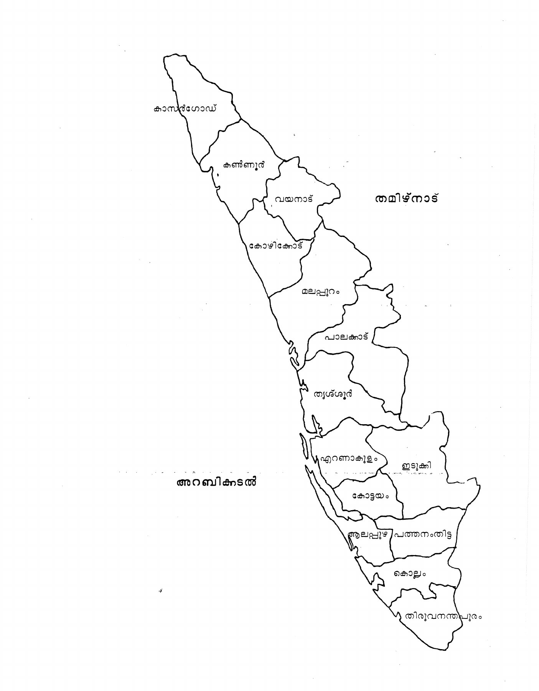
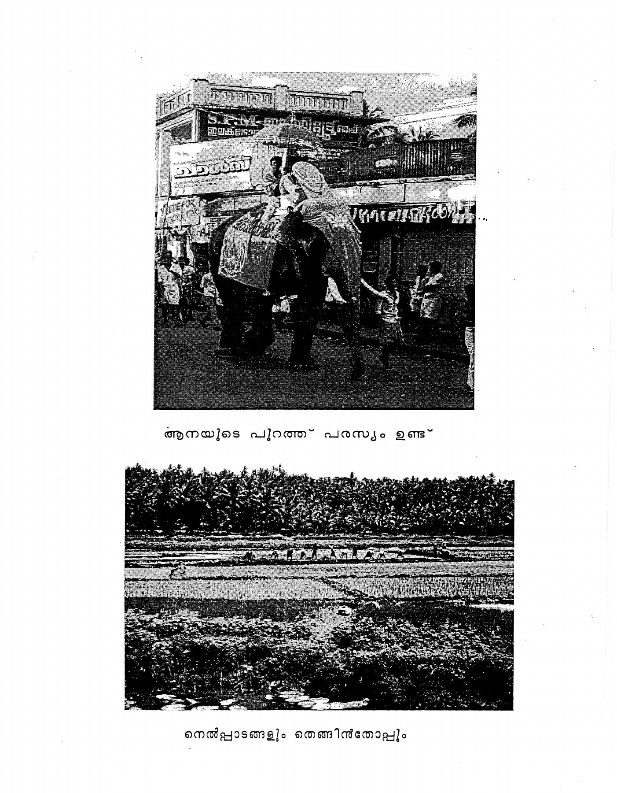
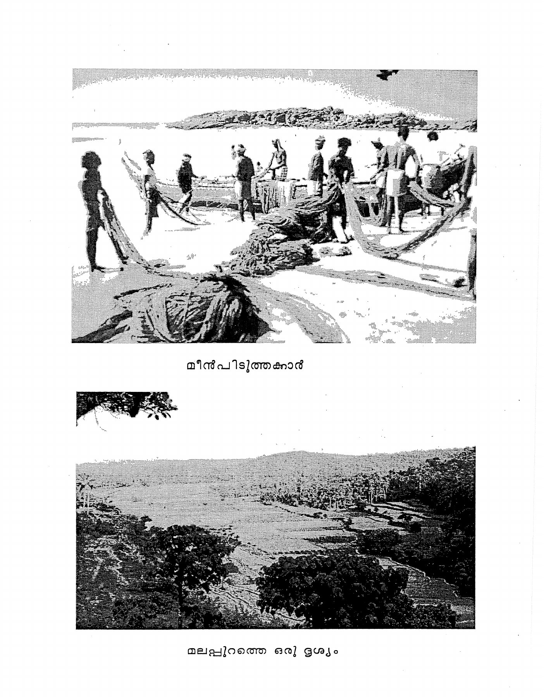

<!-- reading-anchor -->
# Lesson 9: Sharing Saris

<!-- Source: PDF page 177; printed page 127. -->

<!-- reading-anchor -->
## Reference List

<!-- reading-anchor -->
### All Forms of Nouns

| Case | അമ്മ | സാർ | രാമൻ |
|---|---|---|---|
| Nominative | അമ്മ | സാർ | രാമൻ |
| Possessive | അമ്മയുടെ | സാറിന്റെ | രാമന്റെ |
| Dative | അമ്മക്ക് | സാറിന് | രാമന് |
| Accusative | അമ്മയെ | സാറിനെ | രാമനെ |
| Addressive | അമ്മയോട് | സാറിനോട് | രാമനോട് |
| Locative | അമ്മയിൽ | സാറിൽ | രാമനിൽ |
| Instrumental | അമ്മയാൽ | സാറാൽ | രാമനാൽ |
| Vocative | അമ്മേ | സാറേ | രാമാ |

<!-- reading-anchor -->
## Vocabulary

| Malayalam | English |
|---|---|
| നല്ല | good |
| ആരുടെ | whose (adjective) |
| ആരുടേത് | whose (pronoun) |
| ചേച്ചിയുടേത് | sister's (one) |
| നന്നായിരിക്കുന്നു | it is very nice |
| പുതിയ | new |
| പുതിയത് | the new one |
| പഴയ | old |
| പഴയത് | old one |
| കൊള്ളാം | that's nice, that's fine |
| രണ്ടും | both |
| നിന്റേത് | yours |
| ഉടുക്കുക | wrap, wear, put on (sari, skirt, dhoti, lungi) |
| നന്നായിരിക്കും | it will be nice |
| ഉടുത്തോളു | go ahead and put it on |
| <!-- Source: PDF page 178; printed page 128. --> ഒന്നും | anything, nothing (with a negative verb) |
| ഒന്നും പറയില്ല | won't say anything |
| എപ്പോഴും | always |
| കൂട്ടുകാരി | friend (feminine) |
| കൂട്ടുകാരൻ | friend (masculine) |
| കൊടുക്കും | will give, give (habitual) |
| ബ്ലൗസ് | blouse |
| ഇതിനോട് | with this, with it |
| ചേരും | will match, will fit (match, fit) (habitual) |
| വേഗം | quickly |
| സമയമായി | the time has come, it's time |
| തയ്യാറാകുക | to be ready |
| പള്ളി | church |
| ചെറുത് (variant of ചെറിയത്) | little one, small one |
| കൊള്ളുക | to fit inside of something, to stick (as an arrow) |

<!-- reading-anchor -->
## Reading Practice

<!-- reading-anchor -->
### A.

Note how **-ിലേക്ക്** (to, toward) and **-ിൽ നിന്ന്** (from) join to the following. Also note that both require the locative case of the noun.

| Word | With “-ിലേക്ക്” | With “-ിൽ നിന്ന്” |
|---|---|---|
| അത് | അതിലേക്ക് | അതിൽ നിന്ന് |
| ഇത് | ഇതിലേക്ക് | ഇതിൽ നിന്ന് |
| കൊച്ചി | കൊച്ചിയിലേക്ക് | കൊച്ചിയിൽ നിന്ന് |
| പള്ളി | പള്ളിയിലേക്ക് | പള്ളിയിൽ നിന്ന് |
| ബസ്സ്റ്റാൻഡ് | ബസ്സ്റ്റാൻഡിലേക്ക് | ബസ്സ്റ്റാൻഡിൽ നിന്ന് |
| ആഫീസ് | ആഫീസിലേക്ക് | ആഫീസിൽ നിന്ന് |
| കട | കടയിലേക്ക് | കടയിൽ നിന്ന് |
| കോളെജ് | കോളെജിലേക്ക് | കോളെജിൽ നിന്ന് |
| <!-- Source: PDF page 179; printed page 129. --> വീട് | വീട്ടിലേക്ക് | വീട്ടിൽ നിന്ന് |
| ചന്ത | ചന്തയിലേക്ക് | ചന്തയിൽ നിന്ന് |
| സ്കൂൾ | സ്കൂളിലേക്ക് | സ്കൂളിൽ നിന്ന് |

Note the doubling of ട to ട്ട in this case.

Note the following exceptions:

| Word | With “-ിലേക്ക്” | With “-ിൽ നിന്ന്” |
|---|---|---|
| അവിടെ | അവിടേക്ക് | അവിടുന്ന് |
| ഇവിടെ | ഇവിടേക്ക് | ഇവിടുന്ന് |

<!-- reading-anchor -->
### B.

Note the written versus colloquial forms of these future negative verbforms.

| Citation Form | Written Form | Colloquial Form |
|---|---|---|
| പറയുക | പറയുകയില്ല | പറയില്ല |
| ചെയ്യുക | ചെയ്യുകയില്ല | ചെയ്യില്ല |
| പഠിക്കുക | പഠിക്കുകയില്ല | പഠിക്കില്ല |
| നടക്കുക | നടക്കുകയില്ല | നടക്കില്ല |
| വരുക | വരുകയില്ല | വരില്ല |
| പോകുക | പോകുകയില്ല | പോകില്ല |
| എടുക്കുക | എടുക്കുകയില്ല | എടുക്കില്ല |
| കൊടുക്കുക | കൊടുക്കുകയില്ല | കൊടുക്കില്ല |
| ഉടുക്കുക | ഉടുക്കുകയില്ല | ഉടുക്കില്ല |
| കേൾക്കുക | കേൾക്കുകയില്ല | കേൾക്കില്ല |
| കഴിക്കുക | കഴിക്കുകയില്ല | കഴിക്കില്ല |
| വക്കുക | വക്കുകയില്ല | വക്കില്ല |
| കിട്ടുക | കിട്ടുകയില്ല | കിട്ടില്ല |
| വായിക്കുക | വായിക്കുകയില്ല | വായിക്കില്ല |
| വാങ്ങിക്കുക | വാങ്ങിക്കുകയില്ല | വാങ്ങിക്കില്ല |
| കാണുക | കാണുകയില്ല | കാണില്ല |
| ഇരിക്കുക | ഇരിക്കുകയില്ല | ഇരിക്കില്ല |
| കളയുക | കളയുകയില്ല | കളയില്ല |
| അയയ്ക്കുക | അയയ്ക്കുകയില്ല | അയയ്ക്കില്ല |
| അറിയുക | അറിയുകയില്ല | അറിയില്ല |
| നോക്കുക | നോക്കുകയില്ല | നോക്കില്ല |
| തരുക | തരുകയില്ല | തരില്ല |
| തയ്യാറാകുക | തയ്യാറാകുകയില്ല | തയ്യാറാകില്ല |

<!-- Editorial correction: source prints തയ്യാറാക്കില്ല (causative) in the final row; corrected to തയ്യാറാകുകയില്ല, the written negative of തയ്യാറാകുക. -->

<!-- Source: PDF page 180; printed page 130. -->

<!-- reading-anchor -->
## Conversation

ഗീത: ഇത് നല്ല സാരിയാണല്ലോ. ആരുടേതാണ്?

കമല: ഇത് ചേച്ചിയുടേതാണ്.

ഗീത: വളരെ നന്നായിരിക്കുന്നു. പുതിയതാണോ?

കമല: അല്ല, പഴയതാ. അത് പുതിയതാണ്.

ഗീത: കൊള്ളാമല്ലോ. രണ്ടും നന്നായിരിക്കുന്നു. തന്റേതാണോ പുതിയത്?

കമല: അതെ, താൻ ഇത് ഉടുക്കാമോ?

ഗീത: ഞാനോ?

കമല: നന്നായിരിക്കും. ഉടുത്തോളു.

ഗീത: അമ്മ എന്ത് പറയും?

കമല: ഒന്നും പറയില്ല. ഞാൻ എപ്പോഴും കൂട്ടുകാരികൾക്ക് എന്റെ സാരികൾ ഉടുക്കാൻ കൊടുക്കും.

ഗീത: ഈ ബ്ലൗസ് ഇതിനോട് ചേരുമോ?

കമല: ഓ, ചേരും. വേഗം ഉടുക്കു, ക്ലാസിന് സമയമായി. നമുക്ക് പോകാം.

ഗീത: ശരി, ഇപ്പോൾ തയ്യാറാകാം.

<!-- reading-anchor -->
## Exercises

**1. A.** Change the adjectives to nouns in the following sentences, making other necessary changes, as in the model:

**Model:** ഇത് നല്ല സാരിയാണ് : ഈ സാരി നല്ലതാണ്.

1. അത് പുതിയ സ്കൂൾ ആണ്.
2. അത് പഴയ ഫിലിം ആണ്.
3. ഇത് ചെറിയ കടയാണ്.
4. ഇത് വലിയ വീടാണ്.
5. അത് അയാളുടെ പുസ്തകമാണ്.
6. ഇത് എന്റെ കാറാണ്.
7. ഇത് ആരുടെ വീടാണ്?
8. അത് അമ്മയുടെ ബ്ലൗസാണ്.
9. ഇത് ജോണിന്റെ കാപ്പിയാണ്.
10. ഇത് നിന്റെ പേനയാണ്.

<!-- Source: PDF page 181; printed page 131. -->

**2. A.** The teacher will show figures on flashcards or on the board. Respond to his questions as in the model:

**Question:** ഇത് എത്രയാ?  
**Answer:** അത് പന്ത്രണ്ടാ.

**B.** Practice counting up to one hundred by tens until you have committed the numbers to memory.

> **Learner note (editorial):** In item 6 below, കാണിക്കാൻ means “to show”: സിനിമ കാണിക്കാൻ കൊണ്ടു പോകാം means “we can take [him] to see a movie.” This causative form is explained in Lesson 20.

**3.** Change the verbs in the following sentences to the definite future (-ും) form as in the model:

**Model:** ഞാൻ അവളെ പഠിപ്പിക്കാം : ഞാൻ അവളെ പഠിപ്പിക്കും.

1. ഞാൻ പണം തരാം.
2. അനുജത്തി സ്കൂളിൽ പോകുന്നു.
3. കേരളത്തിൽ എല്ലാവർക്കും മലയാളം അറിയാം.
4. അമ്മയുടെ ചമ്മന്തി നന്നായിരിക്കുന്നു.
5. സാർ എപ്പോഴും ഈ കസേരയിൽ ഇരിക്കുന്നു.
6. ഞങ്ങൾ അവനെ നാളെ സിനിമ കാണിക്കാൻ കൊണ്ടു പോകാം.
7. ഞാൻ രാത്രിയിൽ ചായ കുടിക്കാം.
8. വൈകുന്നേരം കഴിഞ്ഞ്രാത്രി വരുന്നു.
9. ഞാൻ കുട്ടികളെ നോക്കാം.
10. നമ്മൾ അദ്ദേഹത്തിനെ അന്നുതന്നെ കാണാം.
11. ചേച്ചിയും ചേട്ടനും ബസ്സിൽ ടിക്കറ്റ് വാങ്ങിക്കുന്നു.
12. ഞാൻ എപ്പോഴും എന്റെ കൂട്ടുകാരിയുടെ സാരി ഉടുക്കുന്നു.

**4.** Read the following making sure you understand the meaning, then practice them orally by repeating after the teacher.

1. അടുത്തത് കൊല്ലം ബസ്സാണ്.
2. A. “സാറിന് ഏത് മേശ ഇഷ്ടമായി?”

   B. “ചെറിയത് നന്നായിരിക്കുന്നു. അത് എടുക്കാം.”
3. സിനിമയ്ക്ക് സമയമായി. നമുക്ക് വേഗം നടക്കാം.

<!-- Source: PDF page 182; printed page 132. -->

4. ഈ ബ്ലൗസ് ചേരില്ലെങ്കിൽ, ഞാൻ അത് തരാം.
5. A. “ചേട്ടൻ ഇന്ന് എപ്പോൾ വരും?”

   B. “ആറുമണിക്ക് വരും.”
6. ഞങ്ങൾ രാവിലെ ചായ കുടിക്കും.
7. സാറിന്റെ കാർ വളരെ ചെറുതാണല്ലോ. അതിൽ ഏഴുപേർ കൊള്ളുമോ?
8. ജെയിംസിന്റെ അമ്മ ഈ ചെറിയ പള്ളിയിൽ പോകും.
9. പഴയ പണം കിട്ടുമെങ്കിൽ ഞാൻ നിനക്ക് തന്നെ തരാം.
10. കുറച്ചു രൂപാ കിട്ടുമെങ്കിൽ ഞാൻ കൊല്ലത്തിന് പോകാം.

**5.** Put the following into Malayalam.

1. Please give me the big one.
2. A. “If we don't find good bananas, what will father do?”

   B. “He won't do anything.”
3. Their family has two houses, both are very nice.
4. Which school does your little brother go to?
5. I'll look in this shop; I always buy cloth from here.
6. The time has come. Everything is ready. Come, let's go.
7. She has to teach at seven o'clock. Tell her to walk fast.
8. That car is a good one. Who is sitting in it?
9. A. “Where are you going?”

   B. “I'm going to the market, can you come, too?”

   A. “Yes, I'll be ready right away.”
10. A. “Does your friend drink tea?”

    B. “No, he drinks only coffee.”

**6.** Prepare written Malayalam responses to the following.

1. ഇത്ര വലിയ ഷർട്ട് എനിക്ക് ചേരുമോ?
2. പഴയ അമ്പലം ഇതാണ്, പുതിയത് എവിടെയാണ്?
3. അച്ഛൻ എത്ര മണിക്ക് ആഫീസിൽ നിന്ന് വരും?
4. അവന് ഇഷ്ടമാണെങ്കിൽ നീയും വരാമോ?
5. ദോശയും കാപ്പിയും നന്നായിരിക്കുന്നോ?
6. ഈ സാരി നിനക്ക് നന്നായിരിക്കും. എന്റെ പുതിയ ബ്ലൗസ് നിനക്ക്

   <!-- Source: PDF page 183; printed page 133. -->

   ചേരും. ഉടുക്കുന്നില്ലേ?

7. പഴയ സ്കൂളിന്റെ അപ്പുറത്ത് ആ വലിയ ചന്തയില്ലേ?
8. കേരളത്തിൽ എത്ര അമ്പലം ഉണ്ട്?
9. പോകാൻ സമയമായി. താൻ തയ്യാറായോ?
10. നിനക്ക് വേറെ കൂട്ടുകാരനെ വിളിക്കണോ?

**7. A.** Write the plural of the following words using ‘-കൾ’.

|  |  |
|---|---|
| കൂട്ടുകാരി | ജോലി |
| സാരി | പള്ളി |
| കട | ചന്ത |
| മുറി | വീട് |
| ബുക്ക് | മേശ |
| കസേര | പേന |
| കുട്ടി | മാങ്ങ |
| തുണി | പ്ലേറ്റ് |
| കുട | ക്ലാസ് |
| ബസ് | പേര് |

**B.** Write the plural of the following words using ‘-ങ്ങൾ’. Note that the final ‘-ം’ is removed from the word in forming the plural.

|  |  |
|---|---|
| പുസ്തകം | ഇഷ്ടം |
| പഴം | കുടുംബം |
| പടം | അകം |
| അമ്പലം | അർത്ഥം |

**C.** Write the plural of the following words using ‘-മാർ’.

|  |  |
|---|---|
| പയ്യൻ | അമ്മ |
| അച്ഛൻ | അനിയൻ |
| അനിയത്തി | ചേട്ടൻ |
| ചേട്ടത്തി | ഡാക്ടർ |

<!-- Source: PDF page 184; printed page 134. -->

**8.** Pronunciation Practice. Practice the difference between double dental ത്ത and double retroflex ട്ട in the following pairs.

| Malayalam | English | Malayalam | English |
|---|---|---|---|
| പത്ത് | ten | പട്ട് | silk |
| ചത്തു | died | പട്ടു | withered |
| കത്തി | knife | കട്ടി | hard |
| കുത്തി | stabbed | കുട്ടി | child |
| കുത്തുക | to stab | കൂട്ടുക | to add |
| പത്തി | hood (of a cobra) | പട്ടി | dog |
| കൊത്തുക | to peck | കൊട്ടുക | to knock |
| മൂത്ത | elder | മൂട്ട | bedbug |
| പോത്ത് | buffalo | പോട്ടേ? | may I go? |
| വറത്തു | fried | വറട്ടി | boiled down |

**9.** Provide negative answers to the following using ഒന്നും, ആരും, ഒരിക്കലും.

**Model 1:** ഈ ജോലിക്ക് എന്ത് വേണം?

ഒന്നും വേണ്ട.

**Model 2:** രാവിലെ ചായ കുടിക്കുമോ?

ഒരിക്കലും കുടിക്കില്ല.

1. ഈ മുറിയിൽ എന്തുണ്ട്?
2. അവരിൽ ആരാണ് റ്റീച്ചർ?
3. അവൻ എപ്പോൾ വരും?
4. എല്ലാവരും വരുമോ?
5. സാർ എപ്പോഴും ജോലി ചെയ്യുന്നോ?
6. ചേച്ചി എപ്പോഴും സിനിമ കാണാൻ പോകുന്നോ?
7. അനുജത്തി എന്റെ മുറിയിൽ നിന്ന് എന്ത് എടുക്കും?
8. ചേട്ടൻ നിന്നെ എപ്പോൾ പഠിപ്പിക്കും?
9. നിങ്ങളെയൊക്കെ ആര് നോക്കുന്നു?
10. ഈ ക്ലാസിന് നാളെ എന്ത് വായിക്കണം?
11. സാറിന് ആരെ കാണണം?
12. അവൻ വീട്ടിൽനിന്ന് എന്ത് എടുക്കണം?
13. ഈ ബ്ലൗസിനോട് എന്ത് ചേരും?

<!-- Source: PDF page 185; printed page 135. -->

<!-- reading-anchor -->
## Grammar Notes

<!-- reading-anchor -->
### 9.1 Making Pronouns and Noun Phrases from Adjectives

Any adjective in Malayalam may be made into a noun simply by the addition of the neuter pronoun അത്. Possessive adjectives end in എ and most other adjectives in the language end in അ whether they are basic adjectives or complex adjectives derived from nouns or verbs. With all adjectives, when adding അത്, the initial അ is lost leaving the form -ത്. The addition of -ത് yields a pronoun in the case of a possessive adjective, and a noun phrase in the case of basic adjectives, and a verbal noun or noun phrase in the case of a verbal adjective.

Witness:

1. നിങ്ങളുടെ “your”, നിങ്ങളുടേത് “yours”
2. പുതിയ “new”, പുതിയത് “a, the new one.”
3. വാങ്ങിക്കുന്നത് “buying, the one who is buying, that which is being bought.”

Only the first two types are discussed here; verbal nouns are treated in [15.6](lesson15.md#section-15-6) and 18.7.

The use of the possessive pronouns parallels that of English. This is confusing, however, for outside of the personal pronouns (mine, yours, etc.) the adjective and the pronoun are identical in form in English. We falsely assume that the form “sister’s” in “this is sister’s blouse” and “this blouse is sister’s” represent the same form because they look alike. Actually Malayalam and English have the same rule that if the predicate shows possession, it must be in the form of a pronoun. These examples may help to cut through the confusing grammatical terminology.

4. ഈ പണം എന്റേതാണ്. “This money is mine.” (not my)
5. ആ ടിക്കറ്റ് മണിയുടേതാണ്. “That ticket is Mani’s.”

Leaving possessives aside, the predicate adjective is a regular feature of English sentences as in “the house is small”, “the church is old”, etc. This rule must be kept in your English bag of tricks only, for Malayalam requires a noun phrase in all predicates of equative sentences. Witness:

6. അയാളുടെ കാർ വലിയതാണ്.

   “His car is big” literally “His car is a big one.”

<!-- Source: PDF page 186; printed page 136. -->

These derived nouns can fulfill every other grammatical function, in the full range of sentence types. Moreover, they can take all of the endings which other nouns take.

Witness:

7. നമുക്ക് നല്ലത് വാങ്ങിക്കാം. “Let’s buy a good one.”
8. പഴയത് നല്ലതാണ്. “The old one is nice.”
9. ചെറിയതിന് എത്ര രൂപ വേണം. “How much do you want for the little one?”

These forms ordinarily show no difference for singular and plural. When it is important to indicate more than one of something, however, the plural neuter pronoun അവ is used. Thus in pricing lemons you might ask the fruitseller:

10. ചെറിയവക്ക് എന്ത് വേണം? “What do (you) want for the small ones?”

Because of the strict rule requiring predicate nouns, we often find nouns in Malayalam sentences which are equivalent to adjectives in English. Two such nouns എളുപ്പം, “easy, fast”, and പ്രയാസം, “difficult” are found in Lesson Ten and Lesson Nineteen respectively. Malayalam has only a small number of true adjectives. The vast majority of adjectives are made from nouns. <!-- Editorial correction: source prints nominal ഉള്ളത്; the adjectival participle is ഉള്ള. --> The most common devices for doing this are the present participle ഉള്ള derived from ഉണ്ട് and ആയ, derived from ആയി (see [20.1](lesson20.md#section-20-1) and Lesson 20 Reading Practice).

One basic adjective, ചീത്ത, does not accept അത്, hence has the same form, whether adjective or noun phrase.

Witness:

11. ഇത് ചീത്ത കാപ്പിയാണ്. “This is bad coffee.”
12. ഈ കാപ്പി ചീത്തയാണ്. “This coffee is bad.”

Malayalam actually contains very few true adjectives. The vast majority of adjectives must be derived from other words. The common means for making adjectives from nouns is with the present participle of ഉണ്ട്, -ഉള്ള. Thus the noun വേഗം, literally “speed”, which functions as the adverb “fast, rapidly” becomes വേഗമുള്ള “fast, rapid.”

Witness:

13. മണിയുടെ കാർ വേഗമുള്ളതാണ്. “Mani’s car is a fast one.”

<!-- Source: PDF page 187; printed page 137. -->

<!-- reading-anchor -->
### 9.2 The Complex Verb ആയിരിക്കുക

This lesson’s conversation contains the special phrase നന്നായിരിക്കുന്നു.

1. ഈ സാരി നന്നായിരിക്കുന്നു. “This sari is nice.”

Here, നന്ന് is a special form equivalent to നല്ലത്. Note that it is a noun phrase only and never occurs as an adjective. The use of the verb ആയിരിക്കുക gives a temporary meaning, referring to the qualities of an item, in this case the sari, in a specific situation only, not in general.

In other cases, ആയിരിക്കുക means “has become (particularly in the very recent past).”

Witness:

2. അവർ ഡാക്ടർ ആയിരിക്കുന്നു.

   “She (respected) has become a doctor.”

3. അത് പഴയതായിരിക്കുന്നു.

   “It has gotten old.”

The most basic element in the meaning of ആയിരിക്കുക in such cases is a change of state.

<!-- reading-anchor -->
### 9.3 Temporary versus Inherent Good

There can be some confusion as to when to use നല്ലതാണ് versus നന്നായിരിക്കുന്നു, since both may be rendered as “good” or “nice.” <!-- Editorial correction: source reads “will either alternative”; corrected to “with either alternative”. -->

Example 1 with either alternative refers to the quality which something will have in a specific situation at a particular and limited time.

1. ഈ സാരി നന്നായിരിക്കുന്നു, or

   ഈ സാരി നല്ലതായിരിക്കുന്നു. “This sari is good, nice.”

This means that it will be nice on a particular person on a specific occasion. Example 2, in contrast, refers to the inherent quality of the sari without respect to time or situation. Thus,

2. ഈ സാരി നല്ലതാണ്. “This sari is a good one.”

This means that the sari is good, whoever wears it, on whatever occasion. This distinction does not hold in some cases, such as in the case of സിനിമ, “movie.”

<!-- Source: PDF page 188; printed page 138. -->

<!-- reading-anchor -->
### 9.4 The Special Expression കൊള്ളാം

The intentive/potential form കൊള്ളാം is also used to render certain senses of “that’s good.” Whereas നല്ലതാണ് and നന്നായിരിക്കുന്നു refer to the inherent or situational qualities of a physical object, കൊള്ളാം is generally used to refer to something intangible such as a fact, an idea, an arrangement, or the like. Thus, in this lesson’s conversation, the use of കൊള്ളാം reflects approval of the information about the saris, not of the saris themselves. A very common use of this form is in approving a plan of action, where it is often interchangeable with ആകട്ടെ (see lesson Five).

Witness:

1. നമുക്ക് ആറ് മണിക്ക് കാണാം. “Let’s meet at six o’clock.”

   അത് കൊള്ളാം. “That’s fine, that will be good.”

Note that കൊള്ളാം can be used in the question form to ask if a proposed course of action is acceptable, whereas ആകട്ടെ can occur only as a statement.

The verb കൊള്ളുക in the sense just described does not occur in any other form except കൊള്ളാം. The basic meaning of the verb elsewhere is “to fit inside of something” or “to stick (as an arrow)”.

Other special uses of കൊള്ളുക will be treated in later lessons.

<!-- reading-anchor -->
### 9.5 The Absolutive and Other Meanings of the Particle -ഉം

Besides being a conjunction (see [3.6](lesson3.md#section-3-6)) -ഉം has other functions. One of these is as a particle adding a generic meaning to a statement or question. Hence when a positive or negative statement of an all-inclusive nature is made, it must contain a generic word carrying the suffix -ഉം. Thus “nothing”, ഒന്നും, in this lesson’s conversation may be thought of as ഒന്ന് plus -ഉം. Similarly, “never”, ഒരിക്കലും is made up of ഒരിക്കൽ “once”, plus -ഉം.

1. അവർ ഒന്നും ചെയ്യുന്നില്ല. “They are doing nothing.”
2. അവൻ ഒരിക്കലും ഇവിടെ വരുകയില്ല. “He never comes here.”

Some absolutive expressions are made from question words which lose their interrogative meaning when -ഉം is added. Thus ആര് “who” plus -ഉം becomes ആരും

<!-- Source: PDF page 189; printed page 139. -->

“no one/anyone”, എപ്പോൾ “when” becomes എപ്പോഴും “always”, എന്ന് “which day” plus -ഉം becomes എന്നും “daily/everyday” and എവിടെ “where” plus -ഉം becomes എവിടെയും “nowhere/anywhere”. Note:

3. ആ മുറിയിൽ ആരുമില്ല. — “There’s no one in that room.”  
4. ഞാൻ എവിടെയും പോയില്ല. — “I didn’t go anywhere.”

The generic meaning of -ഉം also operates in positive statements. Witness:

5. അവൻ എപ്പോഴും വരും. — “He always comes here.”  
6. എല്ലാവരും ഇവിടെയുണ്ട്. — “Everyone is here.”  
7. അവർ എല്ലാം ചെയ്യുന്നു. — “They are doing everything.”

Note that these expressions can be used in the negative but without the absolutive meaning. Witness:

8. അവൻ എപ്പോഴും വരുകയില്ല. — “He doesn’t always come.”  
9. എല്ലാവരും എന്നും വരുന്നില്ല. — “Not everyone comes everyday.”  
10. ഇന്ന് എല്ലാം ചെയ്യുകയില്ല. — “We won’t do everything today.”

As may be seen, the absolutive word is often different for positive and negative sentences as may be seen from the above examples.

Note that -ഉം must always be the final element in the absolutive expression, occurring after all other elements including case endings. Witness:

11. ഇന്ന് ആർക്കും പഠിക്കണ്ട. — “No one wants to study today.”  
12. എല്ലാവർക്കും സിനിമ ഇഷ്ടമായി. — “Everyone liked the film.”  
13. അത് ആരുടേതുമല്ല. — “It’s no one’s.”  
14. വേറെ ആരെയും വിളിക്കേണ്ട. — “There’s no need to invite anyone else.”  
15. ഈ പുസ്തകം ഒരു കടയിലും കിട്ടുകയില്ല. — “That book is not available in any shop.”  
16. ഞാൻ പണം ഒന്നും തരുകയില്ല. — “I won’t give any money.”

<!-- Source: PDF page 190; printed page 140. -->

The suffix -ഉം can also attach to verb phrases, but with two entirely different meanings. The meaning “also” is conveyed in positive sentences by attaching -ഉം to the citation form. In a negative sentence -ഉം attaches to the present tense verbform before ഇല്ല is added.

17. ആ കടയിൽ ഷർട്ട് നോക്കാം, നല്ലത് കിട്ടുമെങ്കിൽ വാങ്ങിക്കുകയും ചെയ്യാം. — “We’ll look at shirts in that shop, if we find a good one, we’ll buy it, too.”  
18. നാണം കാരണം അവൻ ക്ലാസിൽ ഒന്നും സംസാരിക്കുന്നുമില്ല, ചോദിക്കുന്നുമില്ല. — “Due to shyness he doesn’t say anything nor ask anything in class.”

The second meaning conveyed by -ഉം with verbforms is “even” and this occurs only with the suffix എങ്കിൽ “if”. Witness:

19. നിങ്ങൾ വാങ്ങിക്കുമെങ്കിലും, ഞാൻ വാങ്ങിക്കുകയില്ല. — “Even if you buy, I won’t.” (Note deleted object.)  
20. അവർക്ക് വേണ്ടെങ്കിലും നമ്മൾ അവർക്ക് ചായ കൊടുക്കണം. — “Even if they don’t want, we ought to give them tea.”

Note that the conjunction -ഉം may attach to other elements in negative sentences. In these cases it applies to the specific item rather than to the action of the verb. Because Malayalam uses the same conjunction -ഉം in both positive and negative sentences, Malayalis will use the word “too” in negative sentences in English where North American speakers normally use “either”. Thus:

21. ഞാനും പോകുന്നില്ല. — “I am not going, either.”  
22. അവർ അതും ചെയ്യുന്നില്ല. — “They are not doing that, either.”

<!-- Source: PDF page 191; unnumbered map page following printed page 140. -->

<!-- reading-anchor -->
## Map and Photographs

Map labels:

കാസർഗോഡ് · കണ്ണൂർ · വയനാട് · കോഴിക്കോട് · മലപ്പുറം · പാലക്കാട് · തൃശ്ശൂർ · എറണാകുളം · ഇടുക്കി · കോട്ടയം · ആലപ്പുഴ · പത്തനംതിട്ട · കൊല്ലം · തിരുവനന്തപുരം · അറബിക്കടൽ · തമിഴ്നാട്

<!-- Source: PDF page 192; unnumbered photograph page. -->

Captions:

ആനയുടെ പുറത്ത് പരസ്യം ഉണ്ട്

നെൽപ്പാടങ്ങളും തെങ്ങിൻതോപ്പും

<!-- Source: PDF page 193; unnumbered photograph page. -->

Captions:

മീൻപിടുത്തക്കാർ

മലപ്പുറത്തെ ഒരു ദൃശ്യം

<!-- Source: PDF page 194; blank page preceding Lesson 10. -->

<!-- reading-navigation -->

---

[← Previous: Minilesson A](minilesson-a.md) · [Contents](contents.md) · [Next: Lesson 10: The Geography of Kerala →](lesson10.md)

<!-- /reading-navigation -->
