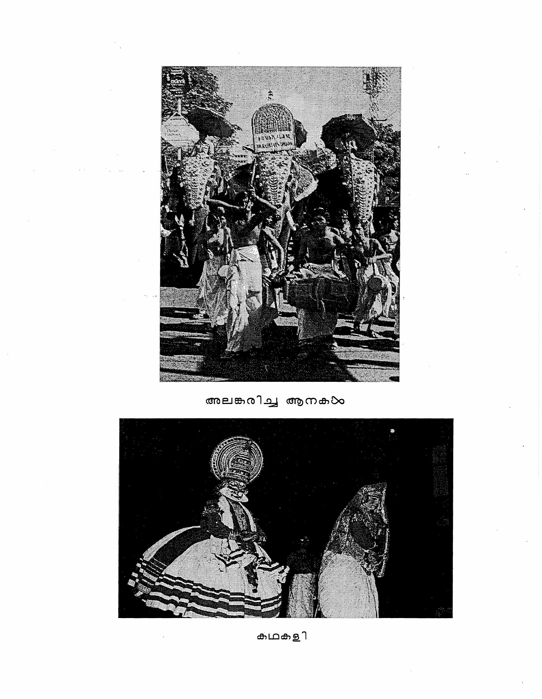
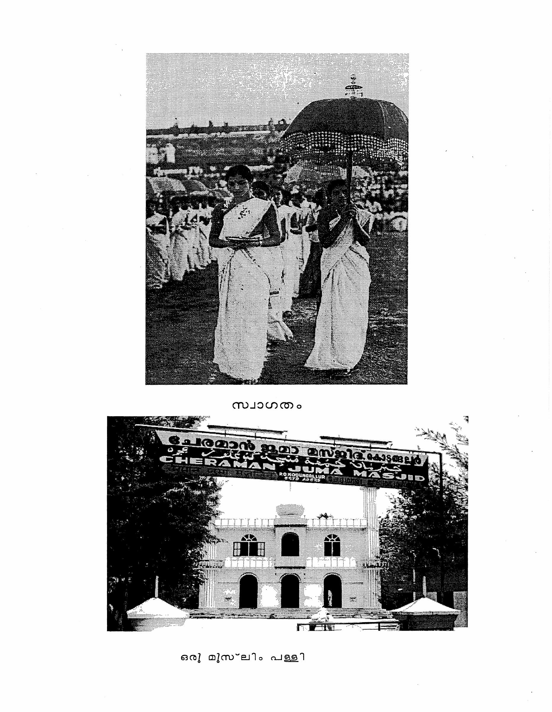

<!-- reading-anchor -->
# Minilesson G

<!-- Source: PDF page 455; printed page 394. -->

<!-- reading-anchor -->
## Pronunciation Changes in Casual Speech

Malayalam is very much like English in that when people speak in a relaxed way, things change, sometimes to an unrecognizable degree. Many foreigners have been mystified by English expressions such as: “Jeechet”, or “Werja gota gichur new shades?” Below are just a few pointers to introduce the commonest of such changes in Malayalam.

In general, changes occur in consonants, not in vowels. Secondly, changes usually occur in single consonants, almost never in double consonants.

Only two consonants change significantly. Final ൾ becomes -ഴ്, but only in the time morpheme -പ്പോൾ (see 11.7). A much more general phenomenon is the weakening of final -ം. This is particularly true in the verb endings -ാം and -ഉം but can occur in nouns ending in -ം as well. What generally happens is that instead of -ം there will be some nasalization of the preceding vowel. If you watch a Malayali’s mouth closely, you will see some lip movement as if to close the lips to make the -ം but stopping far short of closure. Listen to the instructor pronounce these words in a casual manner.

അറിയാം  
പട്ടി കടിക്കും  
ഇതെന്റെ പുസ്തകം

Several consonants weaken dramatically at the middle of words, and at the beginning of words. The weakest of all is ക which often seems to disappear altogether. You may have already noted this in the pronunciation of ആട്ടെ and പോട്ടെ for ആകട്ടെ and പോകട്ടെ. Another set of common examples are the words മകൻ and മകൾ which become മോൻ and മോൾ by virtue of dropping ക and the two short vowels coalescing into long ോ. Words beginning with ക exhibit the same weakening in rapid or casual speech. Thus കണ്ടോ “Did you see” and കൊള്ളാം “That’s fine” take on a pronunciation much like -ണ്ടോ and -ള്ളാം. One of the common features of the casual speech is that separate words are connected together into phrases. Thus അത് കൊള്ളാം and അത് കൊണ്ട് lose an entire syllable when rapidly spoken as അതൊള്ളാം and അതൊണ്ട്. Some authors try to represent these casual speech forms in their plays or stories.

<!-- Source: PDF page 456; printed page 395. -->

The consonant പ also weakens easily in both initial and medial position. Thus പ in കൊണ്ടുപോയി will be inaudible when pronounced rapidly. What remains is a loose bilabial sound something like a light വ. Similarly initial പ in words like പിടിക്കാം “I will catch” almost seem to start with a vowel rather than with the പ.

The next weakest consonant is ച which turns into a sound close to യ particularly in phrases containing forms of the verb ചെയ്യുക such as: എന്ത് ചെയ്യുന്നു?

<!-- Source: PDF page 457; printed page unnumbered. -->

അലങ്കരിച്ച ആനകൾ

കഥകളി

<!-- Source: PDF page 458; printed page unnumbered. -->

സ്വാഗതം

ഒരു മുസ്ലിം പള്ളി

<!-- reading-navigation -->

---

[← Previous: Lesson 24](lesson24.md) · [Contents](contents.md) · [Next: Lesson 25 →](lesson25.md)

<!-- /reading-navigation -->
