<!-- reading-anchor -->
# How to Write Malayalam Symbols

<!-- Source: PDF page 27; printed page xvii. -->

<!-- reading-anchor -->
### Table II: How to Write Word-Initial Vowel Symbols

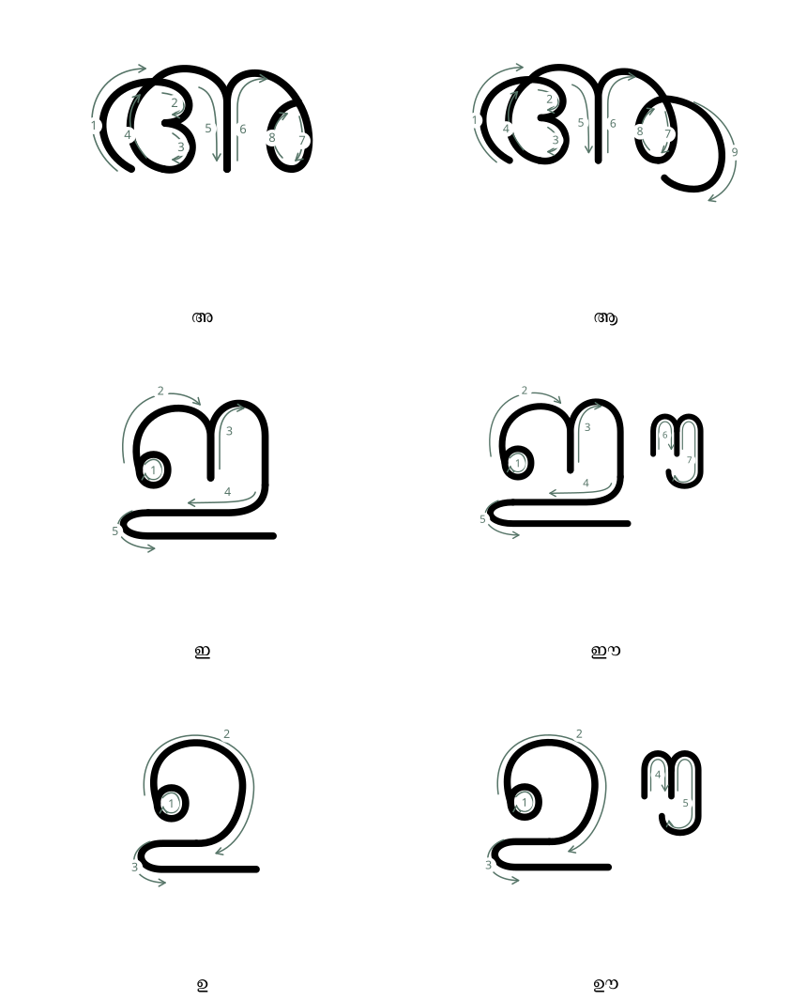

<!-- Source: PDF page 28; printed page xviii. -->

<!-- reading-anchor -->
### Table II: Continued

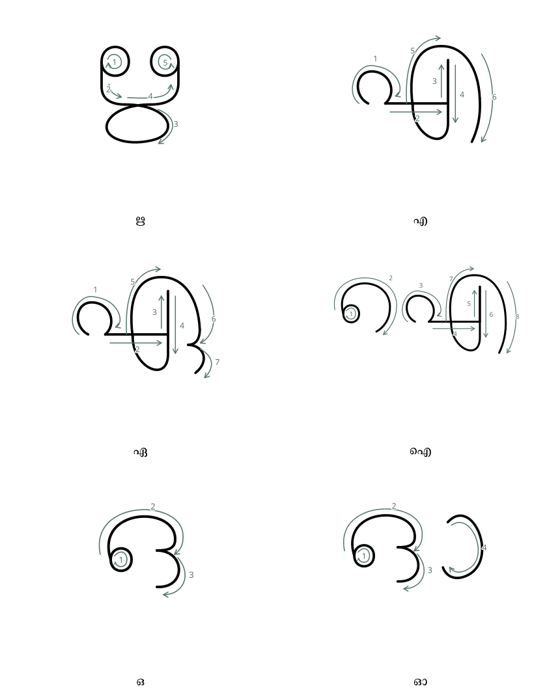

<!-- Source: PDF page 29; printed page xix. -->

<!-- reading-anchor -->
### Table II: Continued

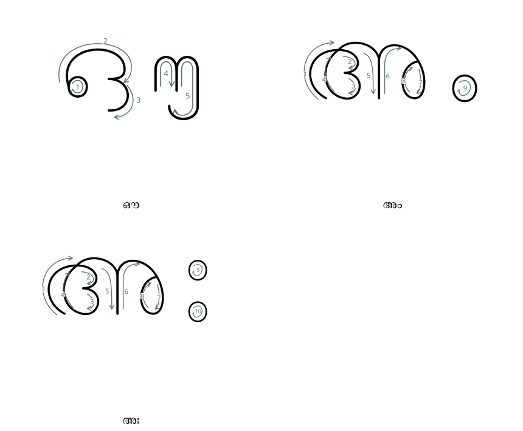

<!-- Source: PDF page 30; printed page xx. -->

<!-- reading-anchor -->
### Table III: How to Write Internal Vowel Symbols

- ാ — as in കാ, ചാ, ടാ, താ, പാ…
- ി — as in കി, ചി, ടി, തി, പി, മി…
- ീ — as in കീ, ചീ, ടീ, തീ, പീ, മീ…

<!-- Source: PDF page 31; printed page xxi. -->

<!-- reading-anchor -->
### Table III: Continued

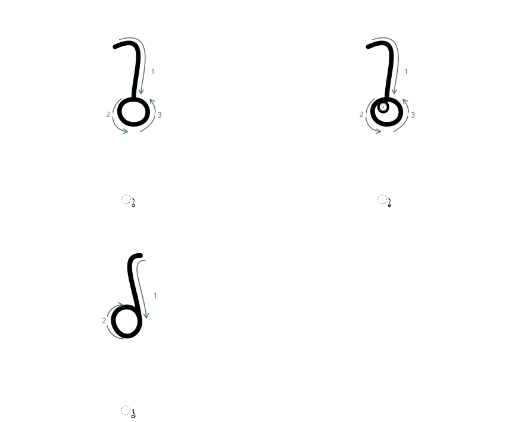

- ു — as in കു, ചു, ടു, തു, പു, മു…
- ൂ — as in കൂ, ചൂ, ടൂ, തൂ, പൂ, മൂ…
- ൃ — as in കൃ, ചൃ, ടൃ, തൃ, പൃ, മൃ…

<!-- Source: PDF page 32; printed page xxii. -->

<!-- reading-anchor -->
### Table III: Continued

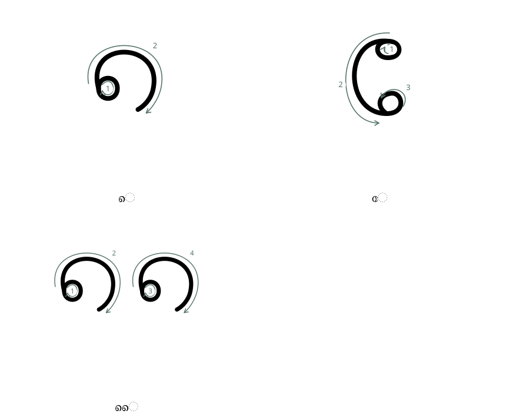

- െ — as in കെ, ചെ, ടെ, തെ, പെ, മെ
- േ — as in കേ, ചേ, ടേ, തേ, പേ…
- ൈ — as in കൈ, ചൈ, ടൈ, തൈ…

<!-- Source: PDF page 33; printed page xxiii. -->

<!-- reading-anchor -->
### Table III: Continued

| Vowel sign | Examples |
|---|---|
| ൊ | കൊ, ചൊ, ടൊ, തൊ... |
| ോ | കോ, ചോ, ടോ, തോ... |
| ൌ | കൗ, ചൗ, ടൗ, തൗ, പൗ, മൗ... |

<!-- Source: PDF page 34; printed page xxiv. -->

<!-- reading-anchor -->
### Table III: Continued

| Sign | Examples |
|---|---|
| ം | കം, ചം, ടം, തം, പം... |
| ഃ | കഃ, ചഃ, ടഃ, തഃ, പഃ, മഃ... |

<!-- Source: PDF page 35; printed page xxv. -->

<!-- reading-anchor -->
### Table IV: How to Write Consonant Symbols

ക, ഖ, ഗ, ഘ, ങ

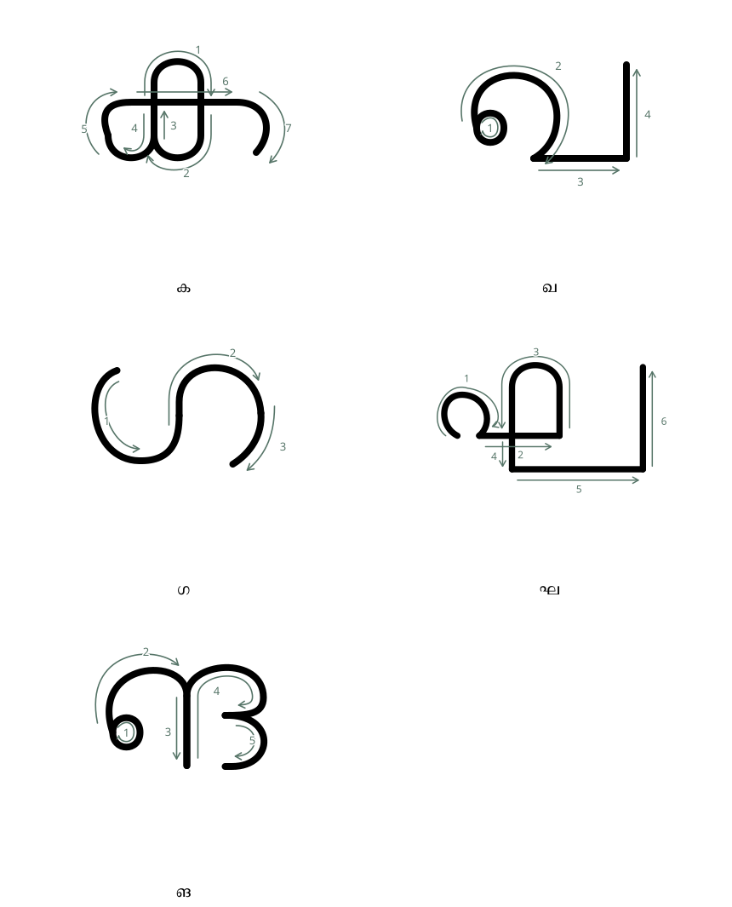

<!-- Source: PDF page 36; printed page xxvi. -->

<!-- reading-anchor -->
### Table IV: Continued

ച, ഛ, ജ, ഝ, ഞ

<!-- Source: PDF page 37; printed page xxvii. -->

<!-- reading-anchor -->
### Table IV: Continued

ട, ഠ, ഡ, ഢ, ണ

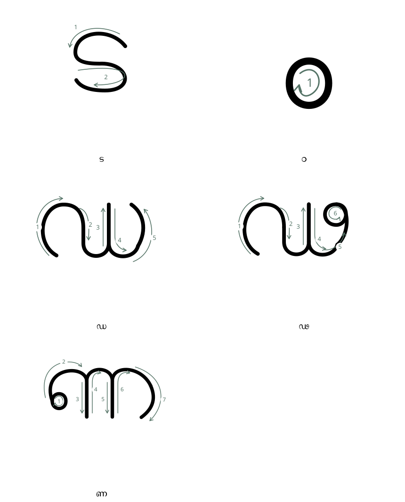

<!-- Source: PDF page 38; printed page xxviii. -->

<!-- reading-anchor -->
### Table IV: Continued

ത, ഥ, ദ, ധ, ന

<!-- Source: PDF page 39; printed page xxix. -->

<!-- reading-anchor -->
### Table IV: Continued

പ, ഫ, ബ, ഭ, മ

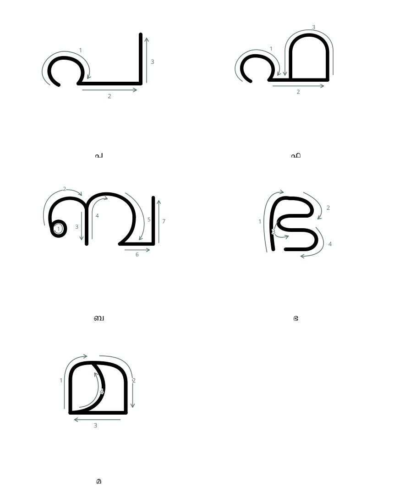

<!-- Source: PDF page 40; printed page xxx. -->

<!-- reading-anchor -->
### Table IV: Continued

യ, ര, ല, വ, ശ, ഷ

<!-- Source: PDF page 41; printed page xxxi. -->

<!-- reading-anchor -->
### Table IV: Continued

സ, ഹ, ള, ഴ, റ

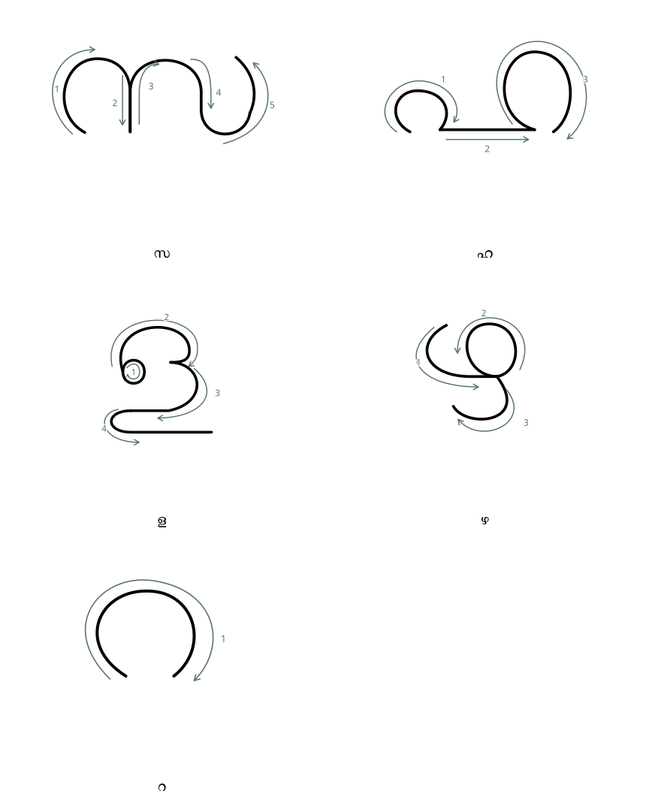

<!-- Source: PDF page 42; printed page xxxii. -->

<!-- reading-anchor -->
### Table V: How to Write Consonants without the Inherent Vowel

A. For three of the consonants, the inherent vowel -അ is suppressed by the addition of a “tail” as follows.

ണ becomes ൺ

ന becomes ൻ

ര becomes ർ

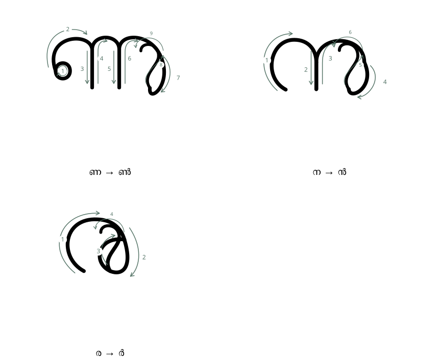

<!-- Source: PDF page 43; printed page xxxiii. -->

<!-- reading-anchor -->
### Table V: Continued

B. For two other consonants, the inherent vowel is suppressed through the use of a completely different character as follows.

ല becomes ൽ

ള becomes ൾ

C. For all other consonants, the inherent vowel is suppressed by the use of the echo vowel (-്), which is written at the upper right-hand corner of the consonant, as in the following examples:

ക്, ച്, ട്, ത്, പ്

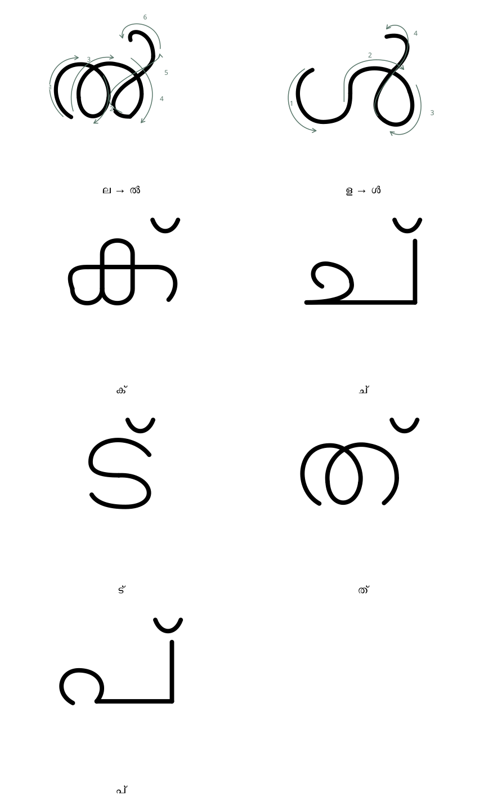

<!-- Source: PDF page 44; printed page xxxiv. -->

<!-- reading-anchor -->
### Table VI: How to Write the Common Double Consonants

| Components | Double consonant |
|---|---|
| ക് + ക | ക്ക |
| ങ് + ങ | ങ്ങ |
| ച് + ച | ച്ച |
| ത് + ത | ത്ത |
| ട് + ട | ട്ട |
| ണ് + ണ | ണ്ണ |
| ന് + ന | ന്ന |
| ബ് + ബ | ബ്ബ |

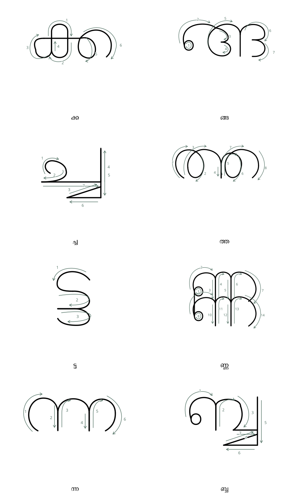

<!-- Source: PDF page 45; printed page xxxv. -->

<!-- reading-anchor -->
### Table VI: Continued

| Components | Double consonant |
|---|---|
| മ് + മ | മ്മ |
| യ് + യ | യ്യ |
| ല് + ല | ല്ല |
| വ് + വ | വ്വ |
| പ് + പ | പ്പ |
| ള് + ള | ള്ള |

<!-- Source: PDF page 46; printed page xxxvii. -->

<!-- reading-anchor -->
### Table VIII: How to Join യ, ര, റ, ല, and വ to Preceding Consonants

A. When യ is the second component of a conjunct, it is represented by the symbol shown in the diagram, which is placed to the right of the preceding consonant, as in ത്യ

ത് + യ = ത്യ

eg. സത്യം (“truth”)

B. When either ര or റ is the second component of a conjunct, that component is uniformly represented by the symbol shown in the diagram, which is placed to the left of the preceding consonant, as in പ്ര

പ + ര = പ്ര

eg. പ്രിയം (“beloved”)

പ + റ = പ്ര

eg. പ്രോക്ടർ (for English “proctor”)

C. When ല is the second component of a conjunct, it is represented by the symbol shown in the diagram, which is placed underneath the preceding consonant, as in പ്ല

പ + ല = പ്ല

eg. പ്ലാവ് (“jackfruit tree”)

D. When വ is the second component of a conjunct, it is represented by the symbol shown in the diagram, which is placed to the right of the preceding consonant, as in സ്വ

സ + വ = സ്വ

eg. സ്വന്തം (“one’s own”)

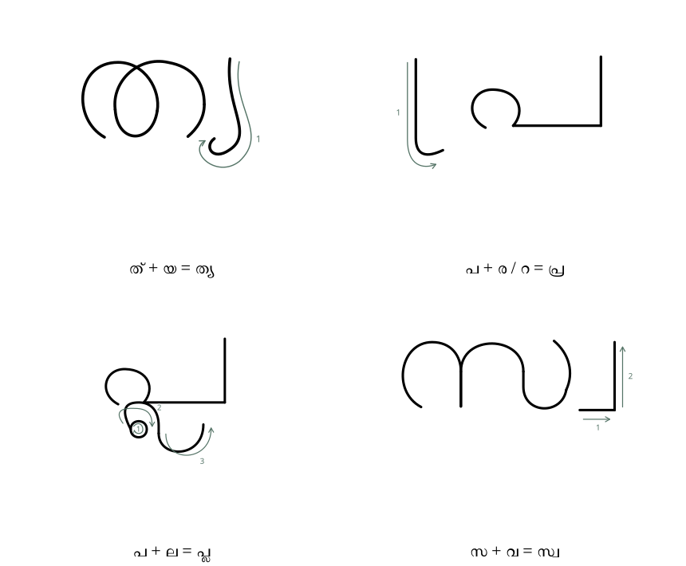

<!-- reading-navigation -->

---

[← Previous: The Malayalam Script](alphabet.md) · [Contents](contents.md) · [Next: Lesson 1: What Is Your Name? →](lesson1.md)

<!-- /reading-navigation -->
