<!-- reading-anchor -->
# How to Write Malayalam Symbols

<!-- Source: PDF page 27; printed page xvii. -->

<!-- reading-anchor -->
### Table II: How to Write Word-Initial Vowel Symbols

<!-- writing-grid:27 -->

  <figure class="writing-card" data-writing-symbol="vowel-a">
    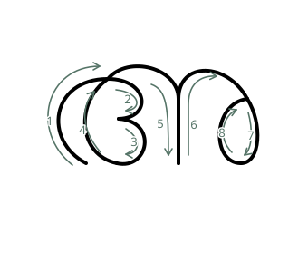
    <figcaption lang="ml">അ</figcaption>
  </figure>
  <figure class="writing-card" data-writing-symbol="vowel-aa">
    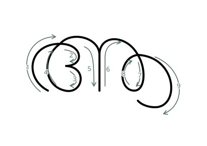
    <figcaption lang="ml">ആ</figcaption>
  </figure>
  <figure class="writing-card" data-writing-symbol="vowel-i">
    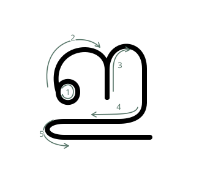
    <figcaption lang="ml">ഇ</figcaption>
  </figure>
  <figure class="writing-card" data-writing-symbol="vowel-ii">
    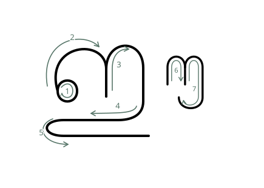
    <figcaption lang="ml">ഈ</figcaption>
  </figure>
  <figure class="writing-card" data-writing-symbol="vowel-u">
    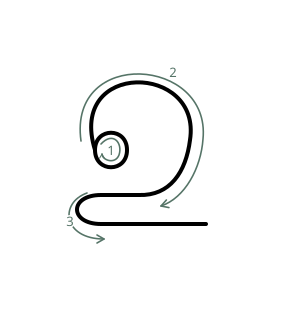
    <figcaption lang="ml">ഉ</figcaption>
  </figure>
  <figure class="writing-card" data-writing-symbol="vowel-uu">
    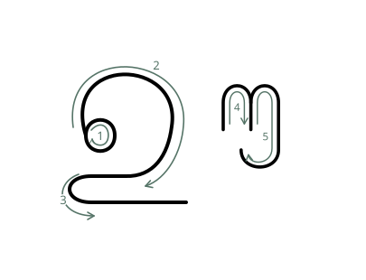
    <figcaption lang="ml">ഊ</figcaption>
  </figure>

<!-- /writing-grid -->

<!-- Source: PDF page 28; printed page xviii. -->

<!-- reading-anchor -->
### Table II: Continued

<!-- writing-grid:28 -->

  <figure class="writing-card" data-writing-symbol="vowel-r">
    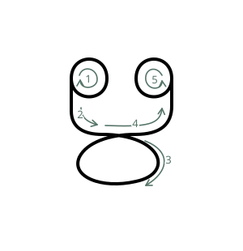
    <figcaption lang="ml">ഋ</figcaption>
  </figure>
  <figure class="writing-card" data-writing-symbol="vowel-e">
    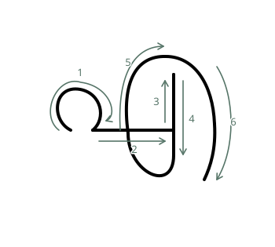
    <figcaption lang="ml">എ</figcaption>
  </figure>
  <figure class="writing-card" data-writing-symbol="vowel-ee">
    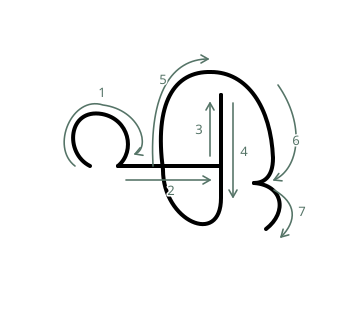
    <figcaption lang="ml">ഏ</figcaption>
  </figure>
  <figure class="writing-card" data-writing-symbol="vowel-ai">
    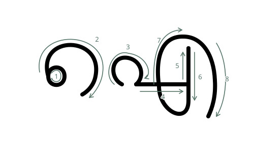
    <figcaption lang="ml">ഐ</figcaption>
  </figure>
  <figure class="writing-card" data-writing-symbol="vowel-o">
    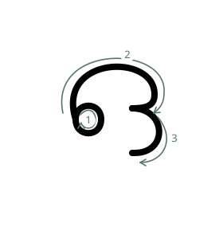
    <figcaption lang="ml">ഒ</figcaption>
  </figure>
  <figure class="writing-card" data-writing-symbol="vowel-oo">
    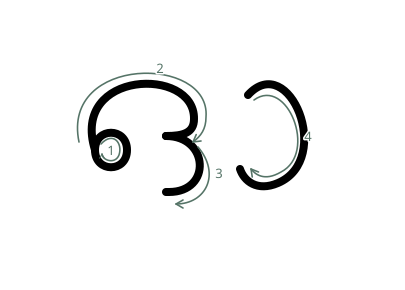
    <figcaption lang="ml">ഓ</figcaption>
  </figure>

<!-- /writing-grid -->

<!-- Source: PDF page 29; printed page xix. -->

<!-- reading-anchor -->
### Table II: Continued

<!-- writing-grid:29 -->

  <figure class="writing-card" data-writing-symbol="vowel-au">
    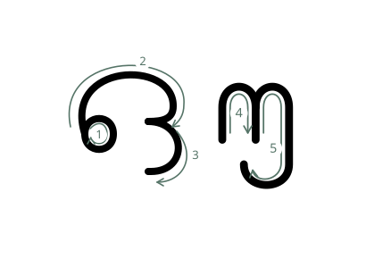
    <figcaption lang="ml">ഔ</figcaption>
  </figure>
  <figure class="writing-card" data-writing-symbol="vowel-am">
    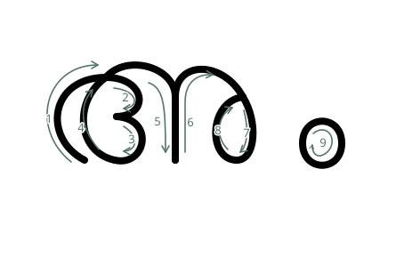
    <figcaption lang="ml">അം</figcaption>
  </figure>
  <figure class="writing-card" data-writing-symbol="vowel-ah">
    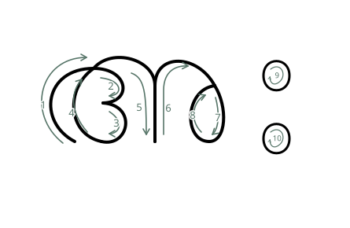
    <figcaption lang="ml">അഃ</figcaption>
  </figure>

<!-- /writing-grid -->

<!-- Source: PDF page 30; printed page xx. -->

<!-- reading-anchor -->
### Table III: How to Write Internal Vowel Symbols

<!-- writing-grid:30 -->

  <figure class="writing-card" data-writing-symbol="sign-aa">
    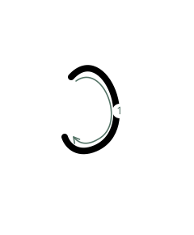
    <figcaption lang="ml">◌ാ</figcaption>
  </figure>
  <figure class="writing-card" data-writing-symbol="sign-i">
    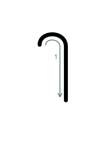
    <figcaption lang="ml">◌ി</figcaption>
  </figure>
  <figure class="writing-card" data-writing-symbol="sign-ii">
    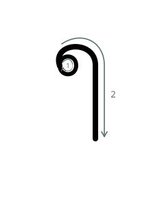
    <figcaption lang="ml">◌ീ</figcaption>
  </figure>

<!-- /writing-grid -->

- ാ — as in കാ, ചാ, ടാ, താ, പാ…
- ി — as in കി, ചി, ടി, തി, പി, മി…
- ീ — as in കീ, ചീ, ടീ, തീ, പീ, മീ…

<!-- Source: PDF page 31; printed page xxi. -->

<!-- reading-anchor -->
### Table III: Continued

<!-- writing-grid:31 -->

  <figure class="writing-card" data-writing-symbol="sign-u">
    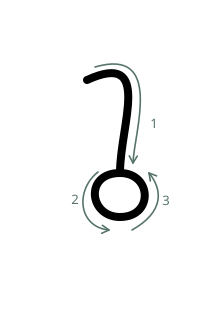
    <figcaption lang="ml">◌ു</figcaption>
  </figure>
  <figure class="writing-card" data-writing-symbol="sign-uu">
    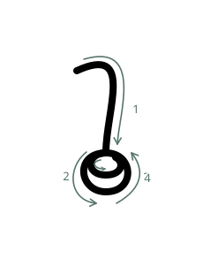
    <figcaption lang="ml">◌ൂ</figcaption>
  </figure>
  <figure class="writing-card" data-writing-symbol="sign-r">
    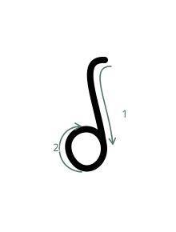
    <figcaption lang="ml">◌ൃ</figcaption>
  </figure>

<!-- /writing-grid -->

- ു — as in കു, ചു, ടു, തു, പു, മു…
- ൂ — as in കൂ, ചൂ, ടൂ, തൂ, പൂ, മൂ…
- ൃ — as in കൃ, ചൃ, ടൃ, തൃ, പൃ, മൃ…

<!-- Source: PDF page 32; printed page xxii. -->

<!-- reading-anchor -->
### Table III: Continued

<!-- writing-grid:32 -->

  <figure class="writing-card" data-writing-symbol="sign-e">
    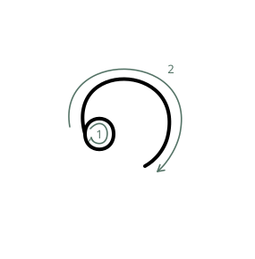
    <figcaption lang="ml">◌െ</figcaption>
  </figure>
  <figure class="writing-card" data-writing-symbol="sign-ee">
    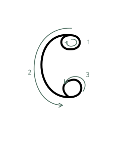
    <figcaption lang="ml">◌േ</figcaption>
  </figure>
  <figure class="writing-card" data-writing-symbol="sign-ai">
    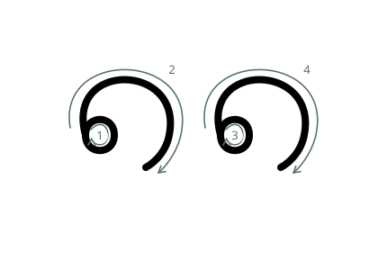
    <figcaption lang="ml">◌ൈ</figcaption>
  </figure>

<!-- /writing-grid -->

- െ — as in കെ, ചെ, ടെ, തെ, പെ, മെ
- േ — as in കേ, ചേ, ടേ, തേ, പേ…
- ൈ — as in കൈ, ചൈ, ടൈ, തൈ…

<!-- Source: PDF page 33; printed page xxiii. -->

<!-- reading-anchor -->
### Table III: Continued

| Vowel sign | Examples |
|---|---|
| ൊ | കൊ, ചൊ, ടൊ, തൊ... |
| ോ | കോ, ചോ, ടോ, തോ... |
| ൌ | കൗ, ചൗ, ടൗ, തൗ, പൗ, മൗ... |

<!-- writing-grid:33 -->

  <figure class="writing-card" data-writing-symbol="sign-o">
    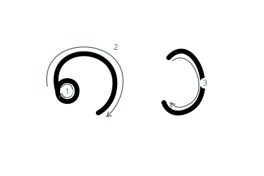
    <figcaption lang="ml">◌ൊ</figcaption>
  </figure>
  <figure class="writing-card" data-writing-symbol="sign-oo">
    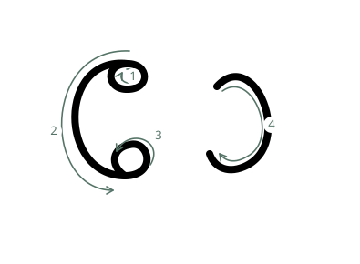
    <figcaption lang="ml">◌ോ</figcaption>
  </figure>
  <figure class="writing-card" data-writing-symbol="sign-au">
    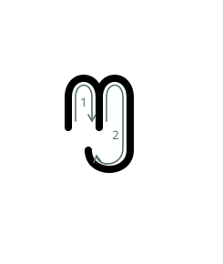
    <figcaption lang="ml">◌ൗ</figcaption>
  </figure>

<!-- /writing-grid -->

<!-- Source: PDF page 34; printed page xxiv. -->

<!-- reading-anchor -->
### Table III: Continued

| Sign | Examples |
|---|---|
| ം | കം, ചം, ടം, തം, പം... |
| ഃ | കഃ, ചഃ, ടഃ, തഃ, പഃ, മഃ... |

<!-- writing-grid:34 -->

  <figure class="writing-card" data-writing-symbol="sign-am">
    
    <figcaption lang="ml">◌ം</figcaption>
  </figure>
  <figure class="writing-card" data-writing-symbol="sign-ah">
    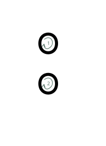
    <figcaption lang="ml">◌ഃ</figcaption>
  </figure>

<!-- /writing-grid -->

<!-- Source: PDF page 35; printed page xxv. -->

<!-- reading-anchor -->
### Table IV: How to Write Consonant Symbols

ക, ഖ, ഗ, ഘ, ങ

<!-- writing-grid:35 -->

  <figure class="writing-card" data-writing-symbol="ka">
    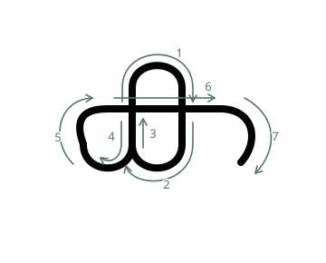
    <figcaption lang="ml">ക</figcaption>
  </figure>
  <figure class="writing-card" data-writing-symbol="kha">
    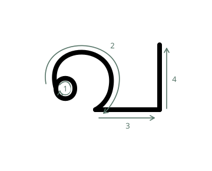
    <figcaption lang="ml">ഖ</figcaption>
  </figure>
  <figure class="writing-card" data-writing-symbol="ga">
    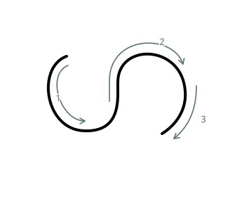
    <figcaption lang="ml">ഗ</figcaption>
  </figure>
  <figure class="writing-card" data-writing-symbol="gha">
    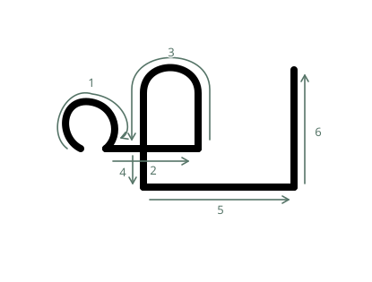
    <figcaption lang="ml">ഘ</figcaption>
  </figure>
  <figure class="writing-card" data-writing-symbol="nga">
    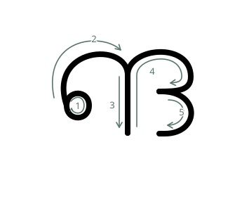
    <figcaption lang="ml">ങ</figcaption>
  </figure>

<!-- /writing-grid -->

<!-- Source: PDF page 36; printed page xxvi. -->

<!-- reading-anchor -->
### Table IV: Continued

ച, ഛ, ജ, ഝ, ഞ

<!-- writing-grid:36 -->

  <figure class="writing-card" data-writing-symbol="cha">
    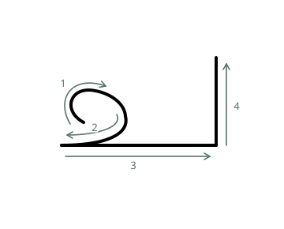
    <figcaption lang="ml">ച</figcaption>
  </figure>
  <figure class="writing-card" data-writing-symbol="chha">
    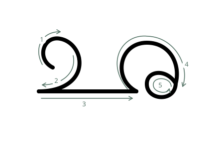
    <figcaption lang="ml">ഛ</figcaption>
  </figure>
  <figure class="writing-card" data-writing-symbol="ja">
    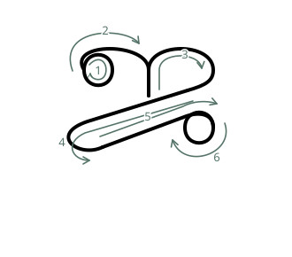
    <figcaption lang="ml">ജ</figcaption>
  </figure>
  <figure class="writing-card" data-writing-symbol="jha">
    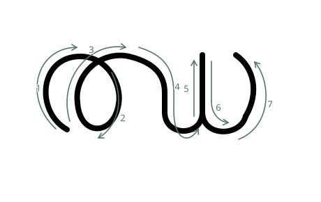
    <figcaption lang="ml">ഝ</figcaption>
  </figure>
  <figure class="writing-card" data-writing-symbol="nya">
    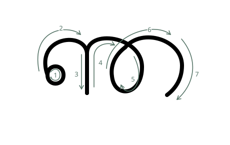
    <figcaption lang="ml">ഞ</figcaption>
  </figure>

<!-- /writing-grid -->

<!-- Source: PDF page 37; printed page xxvii. -->

<!-- reading-anchor -->
### Table IV: Continued

ട, ഠ, ഡ, ഢ, ണ

<!-- writing-grid:37 -->

  <figure class="writing-card" data-writing-symbol="tta">
    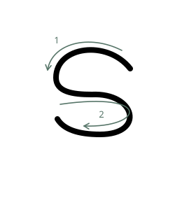
    <figcaption lang="ml">ട</figcaption>
  </figure>
  <figure class="writing-card" data-writing-symbol="ttha">
    
    <figcaption lang="ml">ഠ</figcaption>
  </figure>
  <figure class="writing-card" data-writing-symbol="dda">
    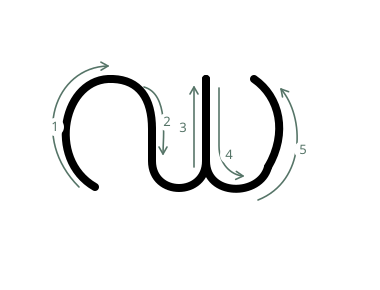
    <figcaption lang="ml">ഡ</figcaption>
  </figure>
  <figure class="writing-card" data-writing-symbol="ddha">
    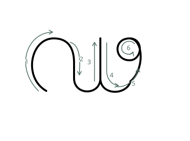
    <figcaption lang="ml">ഢ</figcaption>
  </figure>
  <figure class="writing-card" data-writing-symbol="nna">
    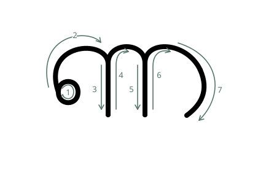
    <figcaption lang="ml">ണ</figcaption>
  </figure>

<!-- /writing-grid -->

<!-- Source: PDF page 38; printed page xxviii. -->

<!-- reading-anchor -->
### Table IV: Continued

ത, ഥ, ദ, ധ, ന

<!-- writing-grid:38 -->

  <figure class="writing-card" data-writing-symbol="tha">
    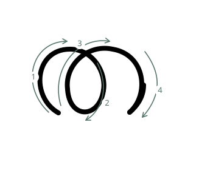
    <figcaption lang="ml">ത</figcaption>
  </figure>
  <figure class="writing-card" data-writing-symbol="thha">
    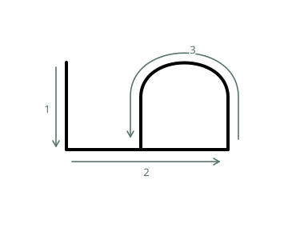
    <figcaption lang="ml">ഥ</figcaption>
  </figure>
  <figure class="writing-card" data-writing-symbol="da">
    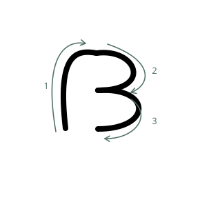
    <figcaption lang="ml">ദ</figcaption>
  </figure>
  <figure class="writing-card" data-writing-symbol="dha">
    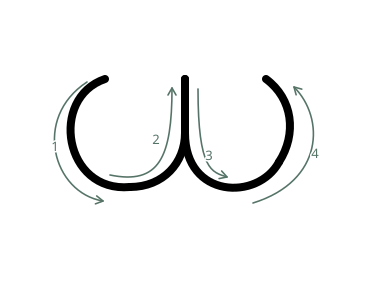
    <figcaption lang="ml">ധ</figcaption>
  </figure>
  <figure class="writing-card" data-writing-symbol="na">
    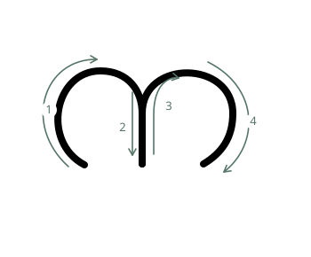
    <figcaption lang="ml">ന</figcaption>
  </figure>

<!-- /writing-grid -->

<!-- Source: PDF page 39; printed page xxix. -->

<!-- reading-anchor -->
### Table IV: Continued

പ, ഫ, ബ, ഭ, മ

<!-- writing-grid:39 -->

  <figure class="writing-card" data-writing-symbol="pa">
    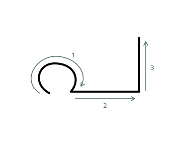
    <figcaption lang="ml">പ</figcaption>
  </figure>
  <figure class="writing-card" data-writing-symbol="pha">
    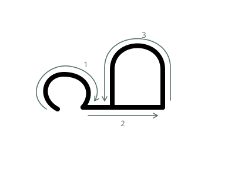
    <figcaption lang="ml">ഫ</figcaption>
  </figure>
  <figure class="writing-card" data-writing-symbol="ba">
    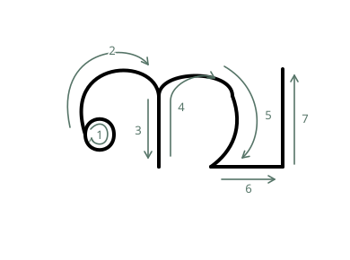
    <figcaption lang="ml">ബ</figcaption>
  </figure>
  <figure class="writing-card" data-writing-symbol="bha">
    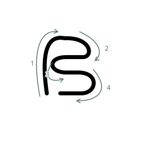
    <figcaption lang="ml">ഭ</figcaption>
  </figure>
  <figure class="writing-card" data-writing-symbol="ma">
    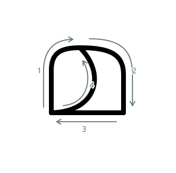
    <figcaption lang="ml">മ</figcaption>
  </figure>

<!-- /writing-grid -->

<!-- Source: PDF page 40; printed page xxx. -->

<!-- reading-anchor -->
### Table IV: Continued

യ, ര, ല, വ, ശ, ഷ

<!-- writing-grid:40 -->

  <figure class="writing-card" data-writing-symbol="ya">
    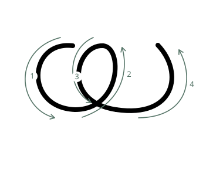
    <figcaption lang="ml">യ</figcaption>
  </figure>
  <figure class="writing-card" data-writing-symbol="ra">
    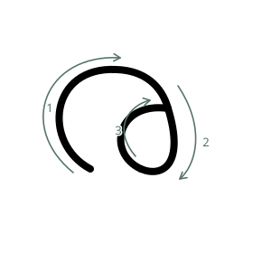
    <figcaption lang="ml">ര</figcaption>
  </figure>
  <figure class="writing-card" data-writing-symbol="la">
    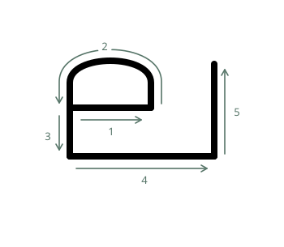
    <figcaption lang="ml">ല</figcaption>
  </figure>
  <figure class="writing-card" data-writing-symbol="va">
    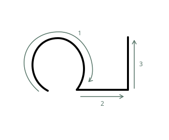
    <figcaption lang="ml">വ</figcaption>
  </figure>
  <figure class="writing-card" data-writing-symbol="sha">
    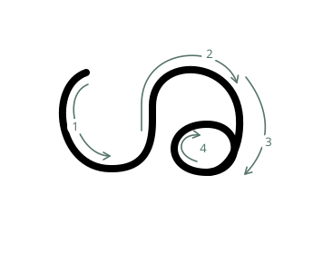
    <figcaption lang="ml">ശ</figcaption>
  </figure>
  <figure class="writing-card" data-writing-symbol="ssa">
    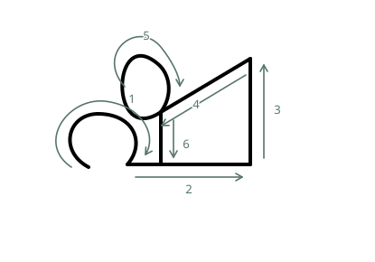
    <figcaption lang="ml">ഷ</figcaption>
  </figure>

<!-- /writing-grid -->

<!-- Source: PDF page 41; printed page xxxi. -->

<!-- reading-anchor -->
### Table IV: Continued

സ, ഹ, ള, ഴ, റ

<!-- writing-grid:41 -->

  <figure class="writing-card" data-writing-symbol="sa">
    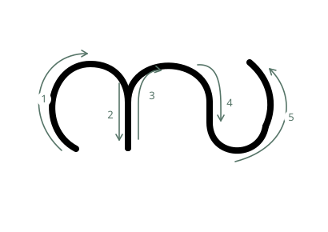
    <figcaption lang="ml">സ</figcaption>
  </figure>
  <figure class="writing-card" data-writing-symbol="ha">
    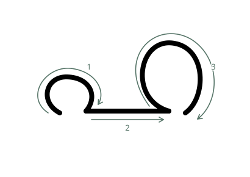
    <figcaption lang="ml">ഹ</figcaption>
  </figure>
  <figure class="writing-card" data-writing-symbol="lla">
    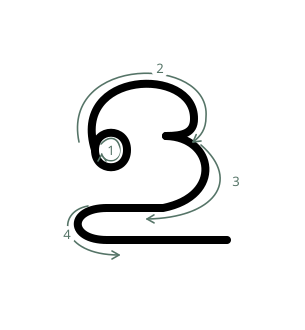
    <figcaption lang="ml">ള</figcaption>
  </figure>
  <figure class="writing-card" data-writing-symbol="zha">
    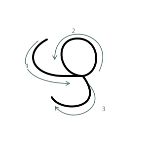
    <figcaption lang="ml">ഴ</figcaption>
  </figure>
  <figure class="writing-card" data-writing-symbol="rra">
    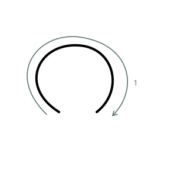
    <figcaption lang="ml">റ</figcaption>
  </figure>

<!-- /writing-grid -->

<!-- Source: PDF page 42; printed page xxxii. -->

<!-- reading-anchor -->
### Table V: How to Write Consonants without the Inherent Vowel

A. For three of the consonants, the inherent vowel -അ is suppressed by the addition of a “tail” as follows.

ണ becomes ൺ

ന becomes ൻ

ര becomes ർ

<!-- writing-grid:42 -->

  <figure class="writing-card" data-writing-symbol="chillu-nn">
    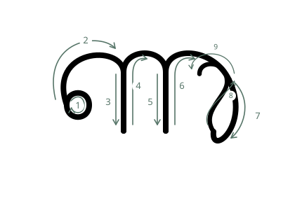
    <figcaption lang="ml">ണ → ൺ</figcaption>
  </figure>
  <figure class="writing-card" data-writing-symbol="chillu-n">
    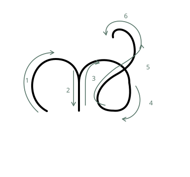
    <figcaption lang="ml">ന → ൻ</figcaption>
  </figure>
  <figure class="writing-card" data-writing-symbol="chillu-r">
    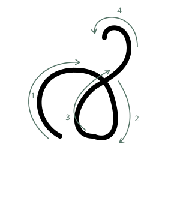
    <figcaption lang="ml">ര → ർ</figcaption>
  </figure>

<!-- /writing-grid -->

<!-- Source: PDF page 43; printed page xxxiii. -->

<!-- reading-anchor -->
### Table V: Continued

B. For two other consonants, the inherent vowel is suppressed through the use of a completely different character as follows.

ല becomes ൽ

ള becomes ൾ

C. For all other consonants, the inherent vowel is suppressed by the use of the echo vowel (-്), which is written at the upper right-hand corner of the consonant, as in the following examples:

ക്, ച്, ട്, ത്, പ്

<!-- writing-grid:43 -->

  <figure class="writing-card" data-writing-symbol="chillu-l">
    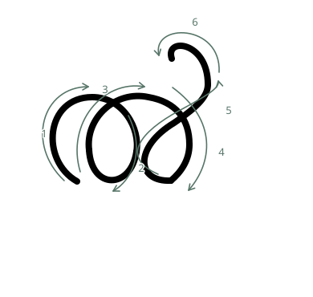
    <figcaption lang="ml">ല → ൽ</figcaption>
  </figure>
  <figure class="writing-card" data-writing-symbol="chillu-ll">
    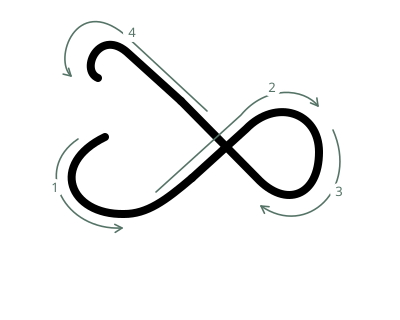
    <figcaption lang="ml">ള → ൾ</figcaption>
  </figure>
  <figure class="writing-card" data-writing-symbol="bare-ka">
    
    <figcaption lang="ml">ക്</figcaption>
  </figure>
  <figure class="writing-card" data-writing-symbol="bare-cha">
    
    <figcaption lang="ml">ച്</figcaption>
  </figure>
  <figure class="writing-card" data-writing-symbol="bare-tta">
    
    <figcaption lang="ml">ട്</figcaption>
  </figure>
  <figure class="writing-card" data-writing-symbol="bare-tha">
    
    <figcaption lang="ml">ത്</figcaption>
  </figure>
  <figure class="writing-card" data-writing-symbol="bare-pa">
    
    <figcaption lang="ml">പ്</figcaption>
  </figure>

<!-- /writing-grid -->

<!-- Source: PDF page 44; printed page xxxiv. -->

<!-- reading-anchor -->
### Table VI: How to Write the Common Double Consonants

| Components | Double consonant |
|---|---|
| ക് + ക | ക്ക |
| ങ് + ങ | ങ്ങ |
| ച് + ച | ച്ച |
| ത് + ത | ത്ത |
| ട് + ട | ട്ട |
| ണ് + ണ | ണ്ണ |
| ന് + ന | ന്ന |
| ബ് + ബ | ബ്ബ |

<!-- writing-grid:44 -->

  <figure class="writing-card" data-writing-symbol="double-ka">
    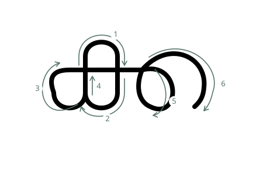
    <figcaption lang="ml">ക്ക</figcaption>
  </figure>
  <figure class="writing-card" data-writing-symbol="double-nga">
    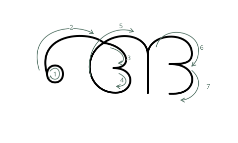
    <figcaption lang="ml">ങ്ങ</figcaption>
  </figure>
  <figure class="writing-card" data-writing-symbol="double-cha">
    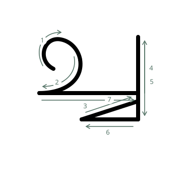
    <figcaption lang="ml">ച്ച</figcaption>
  </figure>
  <figure class="writing-card" data-writing-symbol="double-tha">
    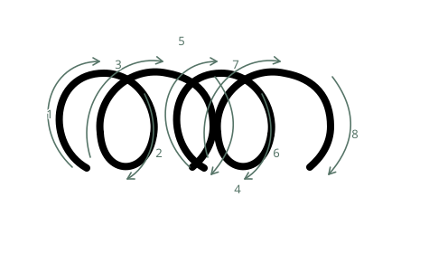
    <figcaption lang="ml">ത്ത</figcaption>
  </figure>
  <figure class="writing-card" data-writing-symbol="double-tta">
    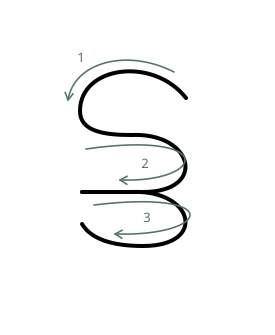
    <figcaption lang="ml">ട്ട</figcaption>
  </figure>
  <figure class="writing-card" data-writing-symbol="double-nna">
    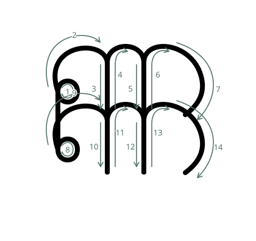
    <figcaption lang="ml">ണ്ണ</figcaption>
  </figure>
  <figure class="writing-card" data-writing-symbol="double-na">
    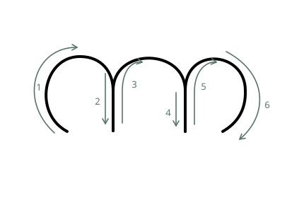
    <figcaption lang="ml">ന്ന</figcaption>
  </figure>
  <figure class="writing-card" data-writing-symbol="double-ba">
    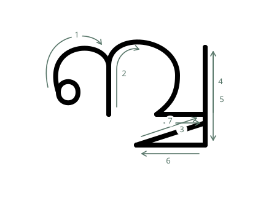
    <figcaption lang="ml">ബ്ബ</figcaption>
  </figure>

<!-- /writing-grid -->

<!-- Source: PDF page 45; printed page xxxv. -->

<!-- reading-anchor -->
### Table VI: Continued

| Components | Double consonant |
|---|---|
| മ് + മ | മ്മ |
| യ് + യ | യ്യ |
| ല് + ല | ല്ല |
| വ് + വ | വ്വ |
| പ് + പ | പ്പ |
| ള് + ള | ള്ള |

<!-- writing-grid:45 -->

  <figure class="writing-card" data-writing-symbol="double-ma">
    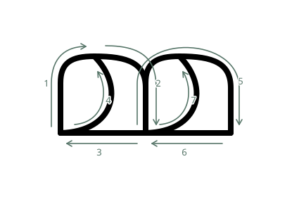
    <figcaption lang="ml">മ്മ</figcaption>
  </figure>
  <figure class="writing-card" data-writing-symbol="double-ya">
    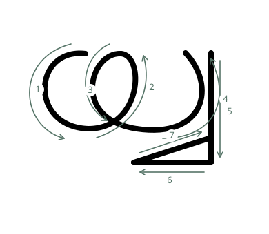
    <figcaption lang="ml">യ്യ</figcaption>
  </figure>
  <figure class="writing-card" data-writing-symbol="double-la">
    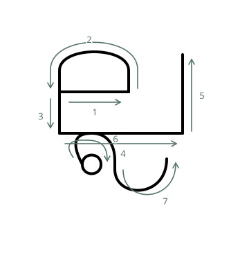
    <figcaption lang="ml">ല്ല</figcaption>
  </figure>
  <figure class="writing-card" data-writing-symbol="double-va">
    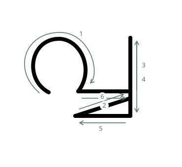
    <figcaption lang="ml">വ്വ</figcaption>
  </figure>
  <figure class="writing-card" data-writing-symbol="double-pa">
    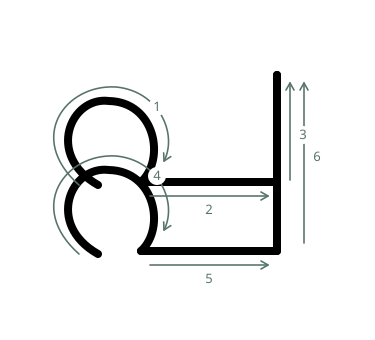
    <figcaption lang="ml">പ്പ</figcaption>
  </figure>
  <figure class="writing-card" data-writing-symbol="double-lla">
    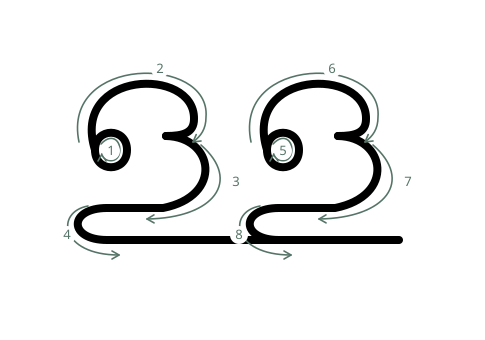
    <figcaption lang="ml">ള്ള</figcaption>
  </figure>

<!-- /writing-grid -->

<!-- Source: PDF page 46; printed page xxxvii. -->

<!-- reading-anchor -->
### Table VIII: How to Join യ, ര, റ, ല, and വ to Preceding Consonants

A. When യ is the second component of a conjunct, it is represented by the symbol shown in the diagram, which is placed to the right of the preceding consonant, as in ത്യ

ത് + യ = ത്യ

eg. സത്യം (“truth”)

B. When either ര or റ is the second component of a conjunct, that component is uniformly represented by the symbol shown in the diagram, which is placed to the left of the preceding consonant, as in പ്ര

പ + ര = പ്ര

eg. പ്രിയം (“beloved”)

പ + റ = പ്ര

eg. പ്രോക്ടർ (for English “proctor”)

C. When ല is the second component of a conjunct, it is represented by the symbol shown in the diagram, which is placed underneath the preceding consonant, as in പ്ല

പ + ല = പ്ല

eg. പ്ലാവ് (“jackfruit tree”)

D. When വ is the second component of a conjunct, it is represented by the symbol shown in the diagram, which is placed to the right of the preceding consonant, as in സ്വ

സ + വ = സ്വ

eg. സ്വന്തം (“one’s own”)

<!-- writing-grid:46 -->

  <figure class="writing-card" data-writing-symbol="join-ya">
    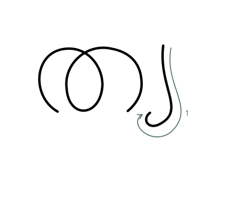
    <figcaption lang="ml">ത് + യ = ത്യ</figcaption>
  </figure>
  <figure class="writing-card" data-writing-symbol="join-ra">
    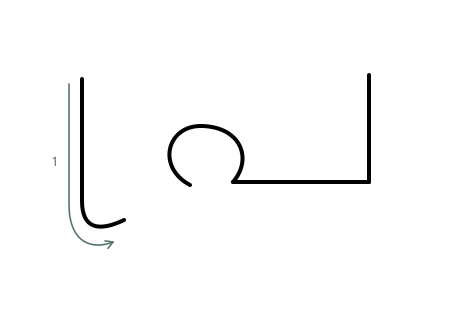
    <figcaption lang="ml">പ + ര / റ = പ്ര</figcaption>
  </figure>
  <figure class="writing-card" data-writing-symbol="join-la">
    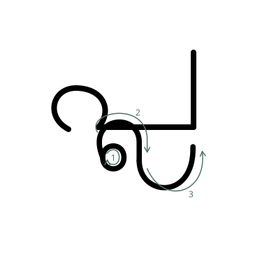
    <figcaption lang="ml">പ + ല = പ്ല</figcaption>
  </figure>
  <figure class="writing-card" data-writing-symbol="join-va">
    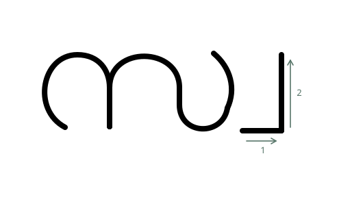
    <figcaption lang="ml">സ + വ = സ്വ</figcaption>
  </figure>

<!-- /writing-grid -->

<!-- reading-navigation -->

---

[← Previous: The Malayalam Script](alphabet.md) · [Contents](contents.md) · [Next: Lesson 1: Introductions and Equative Sentences →](lesson1.md)

<!-- /reading-navigation -->
