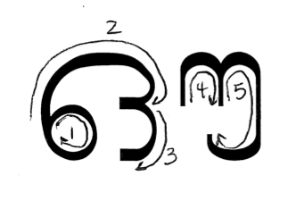
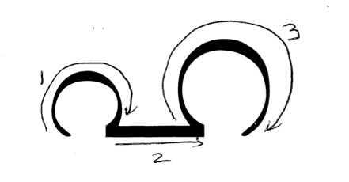

# How to Write Symbols

## Vowels

### Row 1
#### അ

#### ആ

#### ഇ

#### ഈ

#### ഉ

#### ഊ

### Row 2
#### ഋ  	 

#### എ  	 

#### ഏ  	 

#### ഐ  	

### Row 3
#### ഒ  	 

#### ഓ  	 

#### ഔ  	 

#### അം 	 

#### അഃ

## Consonants
### Velar
#### ക

#### ഖ

#### ഗ

#### ഘ

#### ങ

### Postalveolar or Alveolo-palatal
#### ച

#### ഛ

#### ജ

#### ഝ

#### ഞ

### Retroflex
#### ട

#### ഠ

#### ഡ

#### ഢ

#### ണ

### Dental
#### ത

#### ഥ

#### ദ

#### ധ

#### ന

### Labial
#### പ

#### ഫ

#### ബ

#### ഭ

#### മ

### Other
#### യ

#### ര

#### ല

#### വ

#### ശ

#### ഷ

#### സ

#### ഹ

#### ള

#### ഴ

#### റ

## Internal Vowel Symbols

#### ാ

#### ി

#### ീ

#### ു

#### ൂ

#### ൃ

#### െ

#### േ

#### ൈ

#### ൊ

#### ോ
TODO find way to present symbol properly

#### ൈ

#### ൗ

#### ം

#### ഃ

## Chillus

#### ൺ

#### ൻ

#### ർ

#### ൽ

#### ൾ
TODO update to be consistent with typed character

